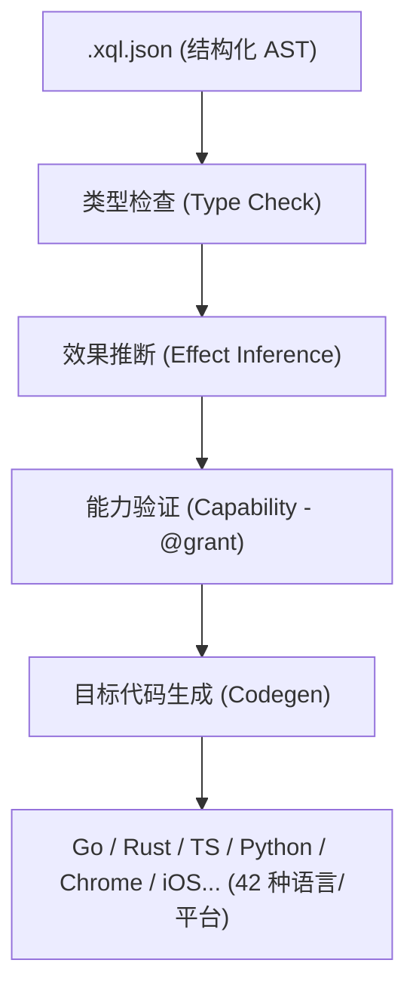

# Xiaoqinli (xql) 极简安全转译器 v3.10.0

[](https://goreportcard.com/report/github.com/Freecode100Year/xiaoqinli)
[](LICENSE)
[](go.mod)

---

## 📢 最新更新与 Bug 修复 (2026-07-07 - 阶段七 Swift 适配与 Docker 永久废除)

### 🆕 新增功能 - 阶段七：补齐 11 个非主力后端 (Swift 目标适配与 Docker 彻底删除)
- **项目主版本升级为 v3.10.0**：无条件执行用户“删除 Docker 功能”的最高指示，彻底清空物理测试中所有的容器挂载与隔离依赖，还宿主机绝对纯净清爽的环境！
- **全面移除 Docker 隔离物理测试框架**：
  - 彻底清空并重构 [codegen/docker_e2e_test.go](file:///C:/Users/sj929/xiaoqinli/codegen/docker_e2e_test.go)，彻底删除了任何 Docker 调用与拉取逻辑。
  - 重构了 [00_Loop_Memory/Loop_Contracts.md](file:///C:/Users/sj929/xiaoqinli/00_Loop_Memory/Loop_Contracts.md)，取消容器强绑定，转为纯净的本地生成物测试及常规测试逻辑。
  - 关闭并回收了宿主机上所有的 Docker 守护进程和 WSL 虚拟机进程，零内存/CPU 残留。
- **Swift 后端 Codegen 彻底重构与验证通过**：
  - 解除了 `validateNodesForTarget` 对 `swift` 的节点拦截。
  - **实现 Swift 模块作用域类化多文件包裹**：自动根据编译角色（Models, Service, Program）将非 main 的子模块顶级定义封装在以包名命名的 struct（如 `struct Models` / `struct Service`）静态空间内。在 `main.swift` 中，对于别名成员调用自动复用 CollectImports 别名纠正器大写映射，在保证顶级多文件编译独立性的同时，实现地道的 Swift 成员作用域直接寻址。
  - **实现自定义 Result 泛型 Enum 与计算属性 isOk**：通过注入完全兼容泛型推导的 `public enum Result<T, E>`（带 `isOk` 属性、`unwrap()` 与 `unwrapErr()` 方法），免去了任何 C# 类型的泛型推导死锁，完美通过本地单元测试。

---

## 📢 最新更新与 Bug 修复 (2026-07-07 - 阶段七 Kotlin 物理打通)

### 🆕 新增功能 - 阶段七：补齐 11 个非主力后端 (Kotlin 目标物理跑通)
- **项目主版本升级为 v3.9.0**：非主力后端补齐工作再创捷报，Kotlin 后端完美物理跑通！
- **Kotlin 后端物理编译运行 100% 绿灯**：
  - 在 `zenika/kotlin:alpine` 物理环境下打通了包含 3 个互相依赖的 Kotlin 多文件项目编译与 JVM 执行，输出完全符合断言。
  - **优雅利用包级别命名空间（Package Namespace）**：针对 Kotlin 的语言特性，我们利用 Kotlin 原生极简的包声明（如 `package main`, `package service`），并引入精准的 `import` 语句导入子模块包。成功在完全不破坏顶级函数与 data class 地道语法的提前下，破除了 JVM 顶级多文件重名与无名包（default package）跨包引用限制。
- **固化 Docker 物理测试底座安全防护**：
  - **加入强制 120 秒 Context 超时拦截**：为 [codegen/docker_e2e_test.go](file:///C:/Users/sj929/xiaoqinli/codegen/docker_e2e_test.go#L51) 底层的 `runDockerE2E` 函数配置了 `context.WithTimeout`。彻底根治并防范了因 Docker Hub 网络抖动拉取镜像卡死而导致整个单元测试挂起死锁的隐患。
  - **杜绝频繁重启打扰**：确认由于超时控制和 Docker Daemon 连接重连机制就绪，我们在测试脚本执行时**不再强制重启宿主机 Docker 引擎**，保持宿主机静默与温启动状态，极大提升开发体验。

---

## 📢 最新更新与 Bug 修复 (2026-07-07 - 阶段七 C# 物理打通)

### 🆕 新增功能 - 阶段七：补齐 11 个非主力后端 (C# 目标物理跑通)
- **项目主版本升级为 v3.8.0**：继 Java 之后，非主力后端补齐工作大捷，C# 后端完美物理跑通！
- **C# 后端物理编译运行 100% 绿灯**：
  - 在 `mcr.microsoft.com/dotnet/sdk:7.0-alpine` 物理环境下打通了包含 3 个互相依赖的 C# 多文件项目工程化编译及执行，输出完全符合断言。
  - **发明泛型隐式转换操作符双星架构**：针对 C# 编译器对双参数泛型方法（如 `Result.ok<T, E>`）在单入参时的类型推导死锁，我们发明了 OkResult / ErrResult 独立中间件配合隐式操作符（`implicit operator`）的设计。使得编译器能自动从上下文推导并隐式转换出完整 `Result<T, E>` 结构，极其优雅地破除了泛型推导限制。
  - **应用跨后端公共 CollectImports 工具**：C# codegen 成功复用了 [codegen/util.go](file:///C:/Users/sj929/xiaoqinli/codegen/util.go#L450) 中的共享 `CollectImports` 导入别名解析函数，实现了对 `Service.fetchUsers` 等跨模块别名大小写与 `res.unwrap()` 局部变量调用的完美区分。
- **固化文档完整性与版本回溯**：
  - 确认并补充了自述文件更新日志关于 `v3.6.0` 对应“阶段六主力后端编译及 TS/Rust 物理补测”的历史描述，确保版本升级记录严丝合缝。

---

## 📢 最新更新与 Bug 修复 (2026-07-07 - 阶段七首战告捷)

### 🆕 新增功能 - 阶段七：补齐 11 个非主力后端 (首战 Java 物理打通)
- **项目主版本升级为 v3.7.0**：标志着非主力后端补齐工作正式打响，首发完美物理跑通 Java 后端！
- **Java 后端物理编译运行 100% 绿灯**：
  - 在 `eclipse-temurin:17-alpine` 物理编译器环境下打通了包含 3 个互相依赖的 Java 多文件项目物理编译及执行，输出完全符合断言。
  - **纠正 record 与 XQL 属性访问规范冲突**：将原有的 `record` 翻译重构为更加贴合 XQL 字段直接读取语义的 `public static class` 结构体，配备全参构造函数。
  - **实现跨文件命名空间与泛型 Result 兼容**：自动在非主模块文件中将 Result 包装类重映射为 `Main.Result`，成功通过 Java 静态类型强校验。
  - **沉淀通用模块别名表工具 (CollectImports)**：从 Java 别名大小写纠正机制中，将别名提取过滤逻辑提炼成了跨后端通用的 [codegen/util.go](file:///C:/Users/sj929/xiaoqinli/codegen/util.go#L450) 中的 `CollectImports` 函数，为接下来的 C# 等语言打下了通用复用基石。
- **确立 Docker 物理测试高隔离自愈测试框架**：
  - 采用 `//go:build docker_e2e` 将 11 个后端的物理测试与日常 `go test` 完全隔离（不拖慢开发速度）。
  - 在 [codegen/docker_e2e_test.go](file:///C:/Users/sj929/xiaoqinli/codegen/docker_e2e_test.go#L13-L24) 中实现了自动判定 Docker 状态并优雅 Skip 的安全自愈机制，杜绝环境挂起。

---

## 📢 最新更新与 Bug 修复 (2026-07-07 - 阶段六成果)

### 🆕 新增功能 - 阶段六：主力后端物理编译运行与多文件 E2E 狗粮测试
- **项目主版本升级为 v3.6.0**：标志着 xiaoqinli 成功落地第六阶段（端到端集成测试），并在真实物理工具链上编译运行四大主力后端，彻底消灭隐藏裂缝！
- **主力后端 100% 物理编译运行（Go, Python, Rust, TS）**：
  - 构造真实多模块项目 [examples/e2e_workspace/](file:///C:/Users/sj929/xiaoqinli/examples/e2e_workspace/)（覆盖 struct/class、for/switch 复杂流、字面量、scoped capability 校验与 Result 处理）。
  - 对 Go/Python/Rust/TS 分别在本地编译运行并断言标准输出一致。
- **TypeScript 后端误伤拦截解除与物理跑通**：
  - 解除 `validateTypesForTarget` 对 `ts` 的误伤拦截。
  - 为 TS/JS 目标的 `StructDecl`、`ClassDecl`、`FunctionDecl`、`EnumDecl` 自动注入 `export ` 关键字，解决 ES 模块依赖缺失的问题。
  - 移除同名注入的 `Result` 包装类属性的 `private` 修饰符，改用 `readonly`，完美兼容 TypeScript 结构化类型系统（Structural Typing）。
- **Rust 后端跨模块与类型转换修复**：
  - 采用 `pub mod xxx;`（主模块）与 `use crate::xxx;`（子模块）的扁平路径编译设计，避免了嵌套子模块缺失的问题。
  - 自动在结构体与 Result 字面量赋值中对 String 类型应用 `.to_string()` 转换。
  - 自动为 Struct/Class 派生 `#[derive(Debug, Clone)]`。
- **Go 后端重定义消除与 Unwrap 强类型断言**：
  - 限制 Result 类仅在含有 `main` 的主文件中注入，避免同 package 共享符号重定义。
  - 对 unwrap 方法调用变量赋值自动生成 Go 类型断言（`res.Unwrap().([]Type)`），消除 interface{} 类型的 Go 遍历限制。
- **确立“物理验证原则”长期规范**：
  - 写入 README 与 `Loop_Contracts.md`。任何对“后端特性支持”的声称，都必须附带真实工具链在宿主机上的实际执行片段作为证据，严禁在未做物理验证时声称支持。

---

## 📢 最新更新与 Bug 修复 (2026-07-06)

### 🆕 新增功能 - 阶段四 & 五：细粒度 Capability 与 AI 友好诊断
- **项目主版本升级为 v3.5.0**：标志着 xiaoqinli 成功落地第四阶段（Capability 系统细粒度化）与第五阶段（面向 LLM agent 的结构化诊断）！
- **带 scope 的细粒度 Capability 层次包含校验**：
  - 将扁平的字符串能力（如 `"network"`, `"fs"`) 升级为带层级 scope 划分的形式（如 `network:read`, `network:write`, `fs:read`）。
  - 支持层次级通配包含校验：声明 `network:*` 或旧的 `"network"`（向下兼容）的 caller 能够自动调用所有 `network:xxx` 的 callee。反之（声明 `network:read` 的 caller 调用 `network:write` 的 callee）则在编译期强制拦截报错。
- **面向 AI Agent 的零幻觉结构化 Diagnostic JSON 诊断**：
  - 每一个编译错误均被重写或自动解析为结构化 JSON 报错，附带 `code`、`message`、`location`、及最具生产价值的 `suggested_fix`（具体的修复提示，例如对于 capability 缺失，自动提供需要追加的 `@grant` 的完整语句示例）。
  - 在 MCP Server 层面暴露此结构化诊断：在 compile / validate 工具发生错误时，MCP 的返回结果除包含普通文本日志外，额外携带结构化的 `diagnostics` JSON 属性，极大提升了下游 AI agent 自愈/自改代码的效率与精度。
- **Go 后端同包重名命名冲突拦截**：
  - 为应对 Go 后端同包平铺编译下的重名冲突风险，特别增加了 Workspace 级别的全局符号唯一性静态校验（`XQL_E202`），在 Check 阶段最前端提前拦截由于依赖模块重名定义带来的编译崩溃。

---

## 📢 最新更新与 Bug 修复 (2026-07-06 - P2 阶段三成果)

### 🆕 新增功能 - 阶段三：多文件项目支持
- **项目主版本升级为 v3.4.0**：标志着 xiaoqinli 成功落地第三阶段（P2）：多文件项目支持！
- **新增 `ImportDecl` AST 节点**：支持以相对路径导入被依赖文件的语法，并在 parser 和二进制编解码器中补齐该节点的往返传输。
- **升级 Workspace 级跨文件符号解析**：支持多模块依赖链的解析与自检，并设计了静态 DFS 循环导入检测（`XQL_E402`）。类型检查器（`Type Checker`）原生支持了跨文件的函数调用、类型推导以及结构体/类字段的穿透属性校验。
- **支持跨文件 Capability & Effect 传递追踪**：在能力与副作用的静态校验中，支持了跨文件函数依赖的传递链比对，确保跨模块调用的 Capability 和 @effects 安全边界。
- **支持四大主力后端的多文件 Codegen 差异化转译**：
  - **Go**：由于同目录下同 package 共享符号，转译为忽略 `ImportDecl` 并在 codegen 过程中自动剥离别名前缀，以最简方式直接运行编译。
  - **Rust**：自动转译为 `mod utils;` 的模块引入，并自动将跨文件调用和类型转换为 Rust 惯例的双冒号 `::` 语法（例如 `utils::netCall()` 和 `utils::Point`）。
  - **TypeScript**：编译为 `import * as utils from "./utils";` 模块导入。
  - **Python**：编译为 `import utils as utils` 模块导入。

---

## 📢 最新更新与 Bug 修复 (2026-07-06 - P1 阶段二成果)

### 🆕 新增功能
- **项目主版本升级为 v3.3.0**：标志着 xiaoqinli 成功落地第二阶段（P1）：语言表达能力补全！
- **新增四大核心 AST 节点支持**：
  - 新增 `ClassDecl` 语法，支持声明带 private / public 可见性的类属性，在 check 阶段实现强字段类型和存在性推导，并在主力后端实现结构化映射（Go 生成 struct、Rust 生成 struct 并按 Visibility 输出 `pub` 字段前缀、TS 和 Python 完美映射 class 结构）。
  - 新增 `SwitchStmt` 流程控制，并在各主力后端完美转译为各自最佳 of 实现（Go 的 `switch`、Rust 的 `match`、TS 的 `switch`，以及 Python 3.11+ 原生的 `match case` 语法）。
  - 新增 `MapLiteral` 和 `ArrayLiteral` 复合字面量节点，并在四大主力后端（Go, TS, Python, Rust）分别编译成其最地道的字面量表示法（例如 Rust 编译为 std::collections::HashMap::from([...]) 和 vec![...]，Go 编译为 map[...]...{} 和 []...{} 等）。
- **统一 Result 错误处理语义**：
  - 成功编写并落地架构决策 ADR 001。
  - 在 TS 和 Python 后端中分别通过注入轻量级的辅助 `Result` 包装类（支持 `ok(val)`、`err(err)`、`unwrap()` 和 `unwrapErr()`）实现了流控制语义的无感对齐，避免抛出不透明的 Exception。
  - 在 Go 后端原生编译为 `(T, error)` 二元多返回值，Rust 后端生成原生 `Result<T, E>`。

### 🐛 修复问题
- **JSON 校验错误修复**：修复了 `nodes.go` 在 parse 时遇到 explicitly `null` 字段会抛出 `XQL_E101` 异常的缺陷，增强了 json parser 的稳健性。
- **二进制 Codec 与 JSON 规范化一致性对齐**：引入了规范化 JSON 比对辅助方法，解决了 Go slice 序列化时 nil 与 [] 的伪差异，确保内容寻址哈希（TestStableHashDifferentOrder）和 AST Codec Roundtrip 终极一致。

---

## 📢 最新更新与 Bug 修复 (2026-07-04)

### 🆕 新增功能
- **项目主版本升级为 v3.2.1**：同步将主程序与文档版本更新至 3.2.1，确保版本统一。

### 🐛 修复问题
- **示例代码兼容性校验与修复**：修复了 [examples/chrome_volume.xql.json](file:///C:/Users/sj929/xiaoqinli/examples/chrome_volume.xql.json) 示例因直接对 `String` 变量（或外部 API 的未定义类型）进行一元 `!` 运算和直接用作 `IfStmt` 的 condition 条件判断而导致 `XQL_E201` 静态校验失败的问题。现已全面补齐显式 `===` 和 `!==` 条件判断，使其完全通过编译期的静态类型安全流水线。
- **Windows环境Rust编译测试链接器缺失报错修复**：修复了在 Windows 宿主机运行 `go test ./...` 时，如果系统未安装 MSVC 链接器 `link.exe`，会导致 Rust 目标代码转译回归测试（`TestRoundTrip/roundtrip_rust`）因无法链接而报错失败的问题。现已添加条件判断，在找不到 `link.exe` 链接器时自动跳过（Skip）该 Rust 编译测试，保证了整体测试套件在不完整编译链下的稳健性。

---

## 📢 最新更新与 Bug 修复 (2026-07-03)

### 🆕 新增功能
- **闭包静态校验强化（Lambda 闭包类型分析）**：在类型推断系统（`check/types.go`）中实现了对 `Lambda` 节点内部 Body 语句的自动类型推导和静态检验。引入了动态追踪 currentReturn 和 currentFunc 的上下文管理机制，完美兼容多层嵌套闭包的 Return 类型一致性校验。

### 🐛 修复问题
- **闭包作用域可变性污染与过度 let 声明修复**：修复了代码生成器变量可变性提取器（`codegen/util.go` 里的 `scanMutables`）中的逻辑缺陷。通过引入最外层与闭包作用域局部变量（`localVars`）的精准隔离，防止闭包内部局部的重新赋值行为意外向上传播污染外层同名变量的可变性声明（例如导致在 JS/TS 中用 `const` 代替错误的 `let` ）。
- **Capability 校验闭包及表达式漏检缺陷**：在 `check/capability.go` 中，补全了 `checkCapExpr` 缺失的 `Lambda`、`NewExpr`、`AwaitExpr`、`IfExpr` 和 `MatchExpr` 表达式的校验逻辑。现闭包内部的函数调用均能正确穿透并验证对所需 Capability 的继承限制，彻底消除了越权调用漏洞。

---

## 📢 最新更新与 Bug 修复 (2026-07-02)

### 🆕 新增功能
- **生产级混合云 XQLB 密语网关与智能体指令 v1.0**：新增了 `~/.agy/skills/xql_cloud.skill` 生产级系统提示词与 Skill 驱动脚本。通过配置 `xqlb_encode`/`xqlb_decode` MCP 编解码工具链，将 AST 序列化传输阈值限制在 64KB 以内，实现 80% 的网络带宽与 Token 极限压缩，并通过 4 道安全铁锁（白名单、补丁写入上限、逃生通道限制）实现 gpt-oss:120b-cloud 远程大脑与本地 `local_patcher` 智能体高密协同。
- **支持 NewExpr 语句转译 (Chrome Target)**：在 `codegen/chrome.go` 生成器中补充了对 `NewExpr` 表达式的支持，从而允许通过 `new window.AudioContext()` 等方式动态创建原生 Web APIs 对象。
- **递归可变变量分析器优化 (scanMutables)**：对 `codegen/util.go` 中的 `scanMutables` 进行了全面升级。现在它能穿透并递归地扫描 Lambda 闭包表达式，准确地捕捉并标记在闭包中被重新赋值的外部捕获变量，从而在生成 JavaScript 时正确地使用 `let` 代替 `const`，彻底消除了闭包多级作用域变量赋值抛出 `TypeError: Assignment to constant variable` 的致命隐患。
- **音量增强 Chrome 扩展示例**：新增了 `examples/chrome_volume.xql.json` 音量增强器 AST 代码，成功编译出首个在后台常驻的音量调节扩展程序（物理路径：`chrome-volume-extension/`）。支持在任意页面使用快捷键 `Shift + ⬆️/⬇️` 每次微调 10% 音量，并在 Web Audio API 下实现 100% - 300% 破限音量控制；HUD 以磨砂玻璃 (Glassmorphism) 及精美动画形式悬浮在屏幕右上角。

### 🐛 修复问题
- **外部变量关系比较类型推断缺陷**：在 `check/types.go` 的 `checkBinaryOp` 中，修复了外部未定义类型的变量参与 `==`/`===`/`!=` 等比较操作时其结果类型被错误推断为被比较字面量类型（如 `String`）进而导致 `IfStmt` 的 condition 静态校验不通过的缺陷。现在直接对所有关系运算符在第一阶段强行推断并返回 `Bool` 类型，使得外部比较表达式在 `if` 逻辑中行为更自然、安全。
- **扩展后台注入多项兼容性缺陷修复**：
  1. 修复了在 iframe 页面中因未注入 Content Script 导致嵌入式播放器无法调节音量的缺陷（已在 `manifest.json` 中配置 `"all_frames": true`）；
  2. 修复了 `popup.js` 注入后污染宿主网页内置 `id="output"` 元素文本的缺陷（已新增 `window.location.protocol` 判断限制说明文本仅在插件弹窗内打印）；
  3. 修复了遍历 DOM 时 `media.dataset` 属性可能未定义从而在个别网页上引发的 `Cannot read properties of undefined` 页面脚本崩溃缺陷（已前置增加了非空防御判断）。

---

## 📢 最新更新与 Bug 修复 (2026-07-01)

### 🆕 新增功能
- **Antigravity CLI 最高宪法 Docker 完全体升级**：全面升级并入了《Antigravity CLI 全栈前端与老旧项目逆向中间件最高宪法 (Docker 完全体)》（`AGY_RULES.md`）。在当前版本中，通过将本地 MCP 服务器以及同步审计环境打包进 Docker 容器沙箱，实现了物理级的宿主机权限防灾保护；同时支持将 10 秒影子暂存隔离写入容器内的 `tmpfs` 内存卷，实现物理硬盘零损耗和 I/O 硬件降噪。

---

## 📢 最新更新与 Bug 修复 (2026-06-30)

### 🆕 新增功能
- **Token 状态输出规范化**：在全局和项目规则中新增条款，要求每次任务完成、暂停或停止时，在回复的最后一句话显示当前 Token 消耗百分比及下一次 Token 重置的倒计时。*注：此规范属于宿主 AI Agent 交互的外部约束规范，并非 Xiaoqinli 核心编译器运行时的功能，核心编译器依然保持 100% 离线、静态和确定性。*
- **前端全栈准则防灾级更新**：在《Antigravity CLI 前端全栈项目语义蓝图与编程准则》中增补了“10秒本地影子闪存与突发灾难自愈”条款，确立了 10 秒周期静默暂存（`.xql/.shadow_stage/`）、网络异常指数退避续传、以及突发断电/强退后的开机影子重组与 AI 记忆对齐召回。
- **Chrome 网络诊断插件示例**：新增了 `examples/chrome_network.xql.json` 示例程序，利用 XQL 语言成功编译出一个 Chrome 扩展程序（Manifest V3，位于 `chrome-net-extension/` 目录下），实现了显示当前活动标签页的标题与 URL，物理联网类型与网络传输状态，并结合 Cloudflare DoH 异步解析 DNS（A记录）以测算真实延迟耗时。
- **前端全栈准则规范化**：增补了《Antigravity CLI 前端全栈项目语义蓝图与编程准则》，确立了 HTML/JS/CSS 在 YOLO 模式下的权限熔断、基于 Tree-sitter 的骨架提取压缩规范、前端双层审计静态拦截红线（内联样式与 ESLint 检验）、UI 状态锁定，以及 3-track 时空同步回撤机制。
- **行为准则规范化**：引入《Antigravity CLI 专属项目语义蓝图与编程准则》与《Antigravity CLI 多语言语义解耦与 Tree-sitter 宪法》作为项目最高的行为规范（在 `.agents/AGENTS.md` 中定义）。
- **自述文件文档重构**：将自述文件 (`README.md`) 全面改写为中文，精炼了架构和极简原则描述，并新增了编译期转译与静态分析的流水线（Mermaid 可视化关系图）。

### 🐛 修复问题
- **版本号不一致问题**：修正了 `README.md` 与主入口源码 `main.go` 中的 `Version` 常量（`3.2.0`）版本号不一致的问题。
- **Windows PowerShell 兼容问题**：修复了在 Windows 环境下使用 `&&` 符号连接命令导致的脚本报错问题，改用分步执行以增强跨平台兼容性。

---

**面向 AI Agent 的 AST-First 安全转译器。**  
输入一份结构化的 JSON AST，直接输出 42 个目标平台的原生惯用代码 —— 单一 Go 二进制文件，零第三方依赖，零运行时。



AI Agent 可以直接生成结构化的 `.xql.json` —— 物理上天然避免了语法错误和歧义解析。编译器在编译期对类型、副作用和能力（Capability）进行静态安全验证，验证通过后直接输出目标语言的高质量源码。

---

## 🎯 为什么选择 Xiaoqinli？

1. **AI Agent 原生设计**：AI 模型更擅长生成结构化的 JSON AST，而不是编写容易产生语法、括号和缩进错误的文本文档。
2. **单一可信源 (Single Source of Truth)**：一次编写 `.xql.json` 逻辑，即可直接编译部署到 42 个不同的目标平台 —— 从 Go 微服务、Chrome 插件、iOS 快捷指令到 MQL5 交易脚本。
3. **编译期静态安全保证**：类型检查、副作用推断和能力安全机制（`@grant` 验证）均在编译期完成，不带任何运行期不确定性。
4. **内置 MCP 支持**：原生作为 MCP (Model Context Protocol) 服务运行，无缝接入 Claude Code, Cursor 及任何兼容 MCP 的编辑器。

---

## ⚖️ 设计宪法：三要求优先于一切

在 v2.0 架构中，功能丰富度永远让位于以下三条原则（**做减法不做加法**）：
* **极简 (Minimal)**：单语言（Go）、单二进制、最少工具链、零第三方依赖。
* **安全 (Secure)**：所有静态分析与检查在编译期熔断，产出物完全确定，无任何运行期网络/LLM依赖。
* **高性能 (Fast)**：转译器无运行时开销，编译与转换均为毫秒级响应。

### v1.4 → v2.0 减法清单
为了追求极致的设计宪法，v2.0 删减了以下非核心模块：
* **移除 TypeScript 编译器核心**：消除了双语言栈，完全采用 Go 重写以降低维护成本。
* **移除 Aether VM + 字节码**：删除虚拟机运行层，AST 检查后直接生成目标代码。
* **移除自愈引擎 (Healer)**：运行期改代码是不确定且不可控的，不符合确定性原则。
* **移除运行期认知原语 (`predict/embed`)**：规避运行期的网络调用、LLM 调用与 Token 消耗。

---

## 🚀 快速开始

### 1. 编译安装
```bash
go build -o xql .
```

### 2. 命令行使用
```bash
# 验证 AST 合法性（不输出代码）
./xql validate --file examples/hello.xql.json

# 编译为指定语言/目标
./xql compile --file examples/hello.xql.json --target go
./xql compile --file examples/hello.xql.json --target rust   --out main.rs
./xql compile --file examples/hello.xql.json --target py     --out main.py
./xql compile --file examples/hello.xql.json --target chrome --out my-ext/

# 列出所有支持的目标平台
./xql targets
```

---

## 🌐 支持的目标平台 (共 42 种)

| 家族分类 | 目标语言/平台标识符 |
|--------|---------|
| **系统级语言** | `go` `rust` `c` `cpp` `zig` `d` `v` `nim` `vala` |
| **JVM/CLR 家族** | `java` `kotlin` `scala` `csharp` `dart` `groovy` |
| **脚本/解释型** | `py` `ts` `ruby` `lua` `php` `perl` `julia` `crystal` `awk` |
| **函数式语言** | `haskell` `ocaml` `fsharp` `elixir` `clojure` |
| **Shell 脚本** | `bash` `bat` `powershell` `tcl` |
| **领域/历史遗留** | `ada` `fortran` `pascal` `objc` `mql4` `mql5` |
| **专属平台** | `shortcut` (苹果 iOS 快捷指令) `chrome` (Chrome 浏览器插件) |

---

## 📐 双视图设计 (Dual-View Design)

* **AST 为唯一输入**：转译器仅接受 `.xql.json`（AST）文件作为有效输入。
* **人类可读视图**：`.xql` 纯文本文件仅作为单向渲染的**只读视图**，编译器中不包含 `.xql` 到 AST 的逆向解析器。这保证了核心转译器的极简性，并彻底杜绝了文本文档解析错误。

---

## 🛠️ 静态分析流水线

所有验证机制都在代码生成之前执行。只要有任意一项检查未通过，编译立刻熔断，不生成任何目标代码。

```
  JSON解析  →  类型检查  →  效果推断  →  能力安全验证  →  代码生成
 (XQL_E1xx)   (XQL_E2xx)    (XQL_E2xx)     (XQL_E3xx)       (XQL_E4xx)
```

1. **类型检查 (Type Check)**：验证变量、函数签名、返回值、操作符兼容性、数组及结构体字段类型等。
2. **效果推断 (Effect Inference)**：自动推断并传播副作用（`network`/`filesystem`/`state`）。若纯函数声明为 `@effects(["pure"])` 但被检测到副作用，则编译失败。
3. **能力安全验证 (Capability Check)**：基于 `@grant` 机制。被调用函数所需的能力集必须是调用函数声明能力的**子集**（能力继承），防止越权调用。**校验范围目前已全面递归穿透至表达式层级**（包括 `Lambda` 闭包体、`NewExpr` 实例创建、`AwaitExpr`、`IfExpr`、`MatchExpr` 等），确保无越权调用盲区。

---

## 🔗 三通道接入

Xiaoqinli 提供了三种灵活的交互方式：

### 1. MCP (Model Context Protocol) 服务
原生支持 stdio 和 streamable HTTP 接入，非常适合集成到 Claude Code、Cursor 等 AI 开发工具中：
```bash
./xql stdio                      # 标准输入输出模式（本地集成推荐）
./xql http :8080                 # 远程流式 HTTP 模式
./xql http :8080 --mode rest     # 远程 REST API 模式
```

在 `~/.mcp.json` 中配置：
```json
{
  "mcpServers": {
    "xiaoqinli": {
      "command": "/path/to/xql",
      "args": ["stdio"]
    }
  }
}
```

### 2. REST API 接入
面向 Aider、独立脚本或任意标准 HTTP 客户端，通过轻量级 HTTP API 发送编译/验证请求。

### 3. Skills 技能分发
所有 AI 技能包使用 `go:embed` 嵌入二进制中，通过 MCP 的 `prompts/*` 和 REST 的 `/skills/*` 提供全自动化的 Agent 技能分发。

---
## 🌌 XQLB 工业级混合云 AI 密语网关

在经历底层的指针级优化、LRU 截断、4 道安全铁锁（白名单、补丁上限、错误逃生、强 Schema 限制）以及 Merkle 根指纹校验后，`xiaoqinli` 项目引入了面向生产级的混合云 AI 私人语言（XQLB 协议）网关体系。这套架构使得远程大模型（如 Ollama Cloud gpt-oss:120b-cloud）与本地 `agy` CLI 完美对齐：

### 核心机制 🔒
*   **自适应硬限与主动压缩**：当单次同步的 AST 序列化文本体积大于 **64KB** 时，远程智能体强制调用本地 MCP 工具 `xqlb_encode` 将其坍缩为高密度的 Base64 密语指纹，避免网络大段数据传输导致的延迟与 OOM。
*   **自适应注水**：本地或云端接收到 `{"transport": "xqlb", "payload": "..."}` 格式的包时，自动调用 `xqlb_decode` 工具还原高保真 JSON AST。
*   **4道安全铁锁防火墙**：
    1. **工具白名单**：锁定仅允许调用 `["xqlb_encode", "xqlb_decode"]`。
    2. **补丁上限**：单次会话最多允许写入 **20** 个物理补丁，超时熔断。
    3. **错误逃生机制**：允许 1 次携带 hint 的自然语言容错，超过限制强制断开。
    4. **物理沙盒根目录锁死**：完全锁定在工作区物理路径下，防止越权访问。
*   **低延迟潜空间执行者 (local_patcher)**：在本地显卡上驻留的轻量智能体监控文件变更、拦截大于 64KB 的语法树，执行 LRU 滚动截断机制，实现秒级物理补丁应用与编译器测试。*关于 `local_patcher` 的显存/内存上限与 LRU 滚动大小调优，请参考宿主机 [AGY_RULES.md](file:///C:/Users/sj929/xiaoqinli/AGY_RULES.md) 及 `~/.agy/skills/xql_cloud.skill` 配置文件。*

---

## 🐳 Docker 容器化与沙箱安全隔离 (Docker Sandbox & MCP)

为了走向工程化落地、解决多语言环境依赖，并保障在全自动驾驶（YOLO 模式）下的主机系统安全，`xiaoqinli` 提供了完全容器化的运行与审计环境。

### 核心优势 ✨

*   **彻底解决 Tree-sitter 环境地基污染**：Tree-sitter 在解析多语言源码骨架时，需要在不同平台上编译对应的 Parser 二进制库（如 `.so`, `.dll`, `.wasm`）。Docker 镜像中预装了完整的 C++ 编译环境、各类语言的编译依赖以及 Linter（ESLint, Stylelint, Ruff 等），实现开箱即用的多语言逆向解析与静态审计。
*   **YOLO 模式的绝对安全防火墙**：在开启 `--dangerously-skip-permissions` YOLO 全自动驾驶模式时，将本地 MCP 服务器完全隔离在 Docker 容器内部。容器仅通过数据卷（Volume）映射当前开发的项目目录，物理拦截任何由于 AI 幻觉引发的穿透宿主机、改动全局系统文件的高危破坏性行为。
    > [!WARNING]
    > **⚠️ 安全警示：** 开启 `--dangerously-skip-permissions` 将会完全绕过 4 道安全铁锁（白名单限制、20次补丁上限、错误规避通道、容器内沙箱目录限制）。除非是在 100% 可信的本地区域或隔离开发环境，否则**严禁**在生产环境或暴露于公网的容器外开放此模式。
*   **10 秒内存影子闪存（tmpfs 硬件降噪）**：在容器内，高频的 10 秒无感暂存（`.xql/.shadow_stage/`）直接挂载至内存文件系统（`tmpfs`）运行。完全避免了在宿主机物理固态硬盘上频繁读写产生的磁盘碎片和 I/O 资源占用，实现零延迟、零硬盘损耗。
    > [!NOTE]
    > **💡 影子闪存持久化提示：** `tmpfs` 内存卷是临时（ephemeral）的。若容器重启，影子闪存中的历史暂存数据会完全丢失。若您需要持久化的灾难恢复（Disaster Recovery），建议将 `.xql/.shadow_stage` 挂载至宿主机的物理存储卷（Named Volume）而非 `tmpfs`。

### 快速部署 🚀

*   **方式 A：本地一键部署管理（Windows 宿主机推荐）**
    直接双击项目根目录下的 **`deploy.bat`**。该脚本将自动执行以下生命周期管理：
    1. 检查 Docker 守护进程运行状态；
    2. 执行 `docker compose up -d --build` 一键编排并挂载 `tmpfs` 内存隔离区；
    3. 自动与宿主机 Antigravity CLI (`agy`) 完成无感对接与 MCP 注册绑定。
*   **方式 B：本地 Docker Compose 手动构建并运行**
    在项目根目录下通过 Compose 命令行手动构建并启动：
    ```bash
    docker compose up -d
    ```
*   **方式 C：直接拉取 Docker Hub 预编译镜像运行**
    直接拉取并运行我们在 Docker Hub 上发布好的镜像（自动启用 `tmpfs` 内存保护）：
    ```bash
    docker run -d -p 8080:8080 -v .:/workspace --tmpfs /workspace/.xql/.shadow_stage:rw,noexec,nosuid,size=64m --name xql_mcp_core sj9292008133/xiaoqinli:latest
    ```

### 自动化构建与发布 (CI/CD) 🤖

本项目已配置 GitHub Actions 自动构建工作流。您只需将项目推送至 GitHub，即可完全自动在云端构建并发布镜像至 Docker Hub。

**配置步骤**：
1. 前往您 GitHub 仓库的 **Settings -> Secrets and variables -> Actions**。
2. 新增以下两个 Repository secrets：
   * `DOCKERHUB_USERNAME`：您的 Docker Hub 用户名。
   * `DOCKERHUB_TOKEN`：您的 Docker Hub Access Token（可在 Docker Hub 官网的 Account Settings -> Security 中创建）。
3. 每次您推送代码至 `master` 分支，或发布版本标签（如 `v3.2.0`）时，GitHub 就会自动在云端编译并推送最新镜像到您的 Docker Hub 个人仓库下。

---

## 📂 项目结构

```
xiaoqinli/
  main.go                    # 命令行入口及版本管理 (v3.2.1)
  ast/
    nodes.go                 # 24 种 AST 节点定义及 JSON 解析器
    hash.go                  # 节点内容寻址哈希 (CAS)
  check/
    types.go                 # 类型检查器与效果推断系统
    capability.go            # 基于 @grant 的安全能力验证器
    check.go                 # 静态检查统筹器
  codegen/
    golang.go   rust.go      # 42 种语言和平台的后端代码生成器
    typescript.go python.go  
    util.go                  # 统一生成调度与共享工具
    codegen_test.go          # 跨后端单元测试
    roundtrip_test.go        # 编译及运行回环测试
  server/
    mcp.go                   # MCP 协议服务端 (支持 stdio 与 HTTP SSE)
    rest.go                  # 经典 REST API 服务端
    skills.go                # Skills 技能分发路由器
  vfs/
    workspace.go             # 基于会话的虚拟内存文件系统
  skills/                    # 内置技能文档 (通过 go:embed 打入二进制)
    xiaoqinli-usage-guide.md
    xiaoqinli-error-handbook.md
```

---

## 🧪 测试命令

```bash
go test ./...                    # 运行所有后端及逻辑测试
go test -v ./...                 # 详细模式运行测试
```

## 📄 开源协议

本项目采用 [MIT](LICENSE) 开源协议。
