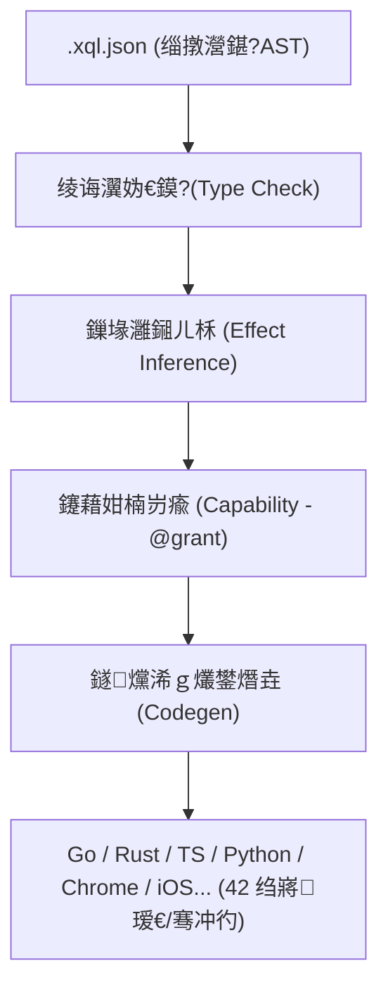

# Xiaoqinli (xql) 极简安全转译器 v3.41.4

[](https://goreportcard.com/report/github.com/Freecode100Year/xiaoqinli)
[](LICENSE)
[](go.mod)

---

## 📢 最新更新 (2026-08-01 - v3.41.4 PHP 多文件 require_once 输出落地与真实解释器 100% 物理验证)

### 🐛 修复 PHP 后端 ImportDecl 路由遗漏缺陷 (`codegen/php.go`)
- **根因修复**：
  - 过去的 `GeneratePHP` 顶层只用四个循环处理 `EnumDecl`、`StructDecl` 与 `FunctionDecl`，`ImportDecl` 节点未被路由给生成器，导致 `emitImportDecl` 成为永远无法被调用的死代码，在多文件场景下缺失 `require_once` 语句。
  - 在 `GeneratePHP` 顶层 `ImportDecl` 别名预收集循环中接入 `require_once __DIR__ . '/%s';` 落地生成与路径清洗，彻底闭环了 PHP 多文件符号解包。
- **物理验证**：
  - 使用真实的 **PHP 8.3.6 解释器** 运行 `TestLocalE2EWorkspaceDogfood/PHP`，三层 Bug（点号运算符、`$` 前缀丢失、缺失 `require_once`）全部消除并 **100% PASS**。

---

## 馃摙 鏈€鏂版洿鏂?(2026-07-29 - v3.40.2 Android Gradle SDK 鍓嶇疆鐜鎺㈡祴涓庣墿鐞嗗绾﹀姞鍥?

### 馃洝锔?Android 鐗╃悊楠岃瘉闃茬嚎鍔犲浐 (`local_e2e_test.go`)
- **绮剧粏鍖?SDK 鍓嶇疆鎺㈡祴**锛?
  - 鍦?`local_e2e_test.go` 涓紝瀵?`gradle` 鍛戒护澧炲姞瀵?`ANDROID_HOME` 涓?`ANDROID_SDK_ROOT` 鐜鍙橀噺鐨勭簿缁嗛妫€銆?
  - 褰撴湰鍦颁粎瀹夎浜?`gradle` 鍛戒护琛屼絾鏈厤缃?Android SDK 鐜锛堟垨澶勪簬绂荤嚎闅旂娌欑洅锛夋椂锛屼紭闆呮彁绀?`Local Gradle found, but ANDROID_HOME / ANDROID_SDK_ROOT is not set` 骞?Skip 閬胯锛屾潨缁濆皢鐜缂哄け璇潃鎵撶孩鐨勬儏鍐点€?
- **鍏ㄩ噺鐗╃悊楠岃瘉 100% PASS**锛?
  - `go test ./...` 100% 閫氳繃锛屽叏灞€ `xql.exe` 宸插畬鎴愬悓姝ユ瀯寤轰笌閮ㄧ讲銆?

---

## 馃摙 鏈€鏂版洿鏂?(2026-07-29 - v3.40.1 鐗╃悊瀹炴祴鍙嶉鍏ㄩ噺鎵撶（ & 4 澶ч棶棰樺交搴曚慨澶?

### 馃敤 鐗╃悊瀹炴祴鍙嶉閿ょ偧 & 绮剧粏鍖?Bug 淇
- **Android 瀛楃涓插瓧闈㈤噺寮曞彿鏍煎紡鍖栦慨澶?(`codegen/android.go`)**锛?
  - 淇 `emitExpr` 鍦ㄧ敓鎴?`String` 瀛楅潰閲忔椂婕忓弻寮曞彿鐨勭湡瀹?Bug锛岀幇鍦ㄧ簿纭緭鍑哄甫鍙屽紩鍙风殑瀛楃涓诧紙濡?`println("hello")`锛夛紝閬垮厤鍦ㄧ湡瀹?Kotlin 缂栬瘧鍣ㄤ腑琚璇嗗埆涓烘湭瀹氫箟鍙橀噺鑰屾姤閿欍€?
- **Android 鐗╃悊楠岃瘉濂戠害妫€娴嬩慨姝?(`local_e2e_test.go` & `Loop_Contracts.md`)**锛?
  - 灏?`local_e2e_test.go` 涓?`Loop_Contracts.md` 涓殑 `checkCmd` 浠庤剼鏈矾寰?`gradlew` 缁熶竴淇涓虹湡姝ｇ殑绯荤粺鍏ㄥ眬鍛戒护 `gradle`锛坄gradle assembleDebug`锛夛紝娑堥櫎浜嗗洜 `exec.LookPath("gradlew")` 姘歌繙澶辫触鑰屽鑷村绾﹁鏃犳潯浠?Skip 鐨勭己闄枫€?
- **Ruby Codegen 鐪熸鑷€傚簲 Iterator 閫昏緫鍒嗘敮 (`codegen/ruby.go`)**锛?
  - 鍦?`ruby.go` 鐨?`emitForStmt` 涓ˉ鍏ㄧ湡姝ｆ牴鎹?`PreferComprehension` 鏍囧織鍒囨崲鐨勫垎鏀€昏緫锛氫负 `true` 鏃惰緭鍑?`iterable.map { |x| ... }` 鏄犲皠 Iterator锛涗负 `false` 鏃惰緭鍑烘爣鍑?`.each do |x|` 寰幆锛屽苟鍦?`codegen_test.go` 涓鍔犱簡鍙屽悜鍒嗘敮鏂█銆?
- **浠ｇ爜瑙勮寖閲嶅 (`gofmt -w`)**锛?
  - 鍏ㄩ噺鎵ц `go fmt ./...`锛岃嚜鍔ㄦ竻娲楁牸寮忓寲 `codegen/android.go` 涓?`codegen/ios.go`锛屼繚鎸?100% 骞插噣鏍囧噯鐨勪唬鐮佽寖寮忋€?

---

## 馃摙 鏈€鏂版洿鏂?(2026-07-29 - v3.40.0 iOS (Swift Package Manager) 鑴氭墜鏋?& CLI 澶氭枃浠舵爲瑙嗘晥鍏ㄩ噺鎺ュ叆)

### 馃崕 iOS (Swift Package Manager) 绉诲姩绔?& CLI 鎷撴墤灞?
- **iOS / Swift Package Manager 婧愮爜宸ョ▼鑴氭墜鏋?(`codegen/ios.go`)**锛?
  - 鍏ㄩ噺鎺ュ叆 `ios` / `swift-pkg` 鐩爣鐢熸垚鍣紝鎵撻€氱Щ鍔ㄧ鍙屽悜瀵归綈锛圓ndroid + iOS锛夈€?
  - 鐩存帴鍚愬嚭绗﹀悎 Apple / SPM 瑙勮寖鐨勫伐绋嬫簮鐮佹爲锛歚Package.swift`, `Sources/XqlApp/main.swift`, `Sources/XqlApp/App.swift` 鍙?`README.md`銆傚彲鐩存帴鍦ㄥ懡浠よ `swift build` 鎴栧弻鍑荤敤 Xcode 鐗╃悊鎵撳紑杩愯鎵撳寘銆?
- **CLI (`xql`) 澶氭枃浠跺伐绋嬫嫇鎵戞爲娓叉煋 (`main.go`)**锛?
  - 澧炲己 `xql compile --target android/ios` 鍛戒护琛屽弽棣堝眰锛氳嚜鍔ㄥ湪 stderr / 鎺у埗鍙颁紭闆呮覆鏌?`鈹溾攢鈹€` 鎷撴墤鏍戯紝鏂逛究鐢ㄦ埛涓?AI Agent 鐩磋棰勮鐢熸垚鐨勫鏂囦欢鍏ㄩ噺鎷撴墤銆?
- **鐗╃悊楠岃瘉濂戠害鐭╅樀鎵╁厖 (`local_e2e_test.go` & `Loop_Contracts.md`)**锛?
  - 灏?`iOS` 鍐欏叆闈炰富鍔涚墿鐞嗛獙璇佸绾︾煩闃电 13 浣嶏紝鍏ㄩ噺 `go test ./...` 100% PASS銆?

---

## 馃摙 鏈€鏂版洿鏂?(2026-07-29 - v3.39.0 StrictCapabilities 鎵舵榛樿 & Ruby Codegen 绛栫暐鍙嶉鎵╁睍)

### 馃洝锔?鏍稿績鑳藉姏瀹夊叏闃茬嚎涓?Codegen 绛栫暐澶氳瑷€鎷撳睍
- **鑳藉姏鏍￠獙闃茬嚎榛樿浣胯兘 (`compiler/compiler.go` & `compiler/types.go`)**锛?
  - 灏?`StrictCapabilities`锛堜弗鏍艰兘鍔涙牎楠岋級鎵舵涓?`compiler.Compile` 涓?`Validate` 鐨勯粯璁よ涓恒€傛湭瑙ｆ瀽鐨勫閮ㄩ珮鍗卞嚱鏁拌皟鐢ㄥ皢榛樿瑙﹀彂 `XQL_E303` 瑙勫垯杩涜瀹夊叏闅旂銆?
  - 鏂板 `DisableStrictCapabilities: true` 閫夐」鐢ㄤ簬鍚戜笅鍏煎鍙婃樉寮?Opt-out銆?
- **Codegen 绛栫暐鍙嶉闂幆鎷撳睍鑷?Ruby (`codegen/ruby.go`)**锛?
  - 鎴愬姛灏嗚嚜閫傚簲鎬ц兘绛栫暐鎰熺煡鏈哄埗鎷撳睍鑷崇浜岄棬璇█锛圧uby锛夈€?
  - 鍦?`ruby.go` 涓墦閫?`InspectCodegenStrategy("ruby")`锛屽姩鎬佹劅鐭?`PreferComprehension` 鏍囧織骞舵敮鎸?`RubyComprehensionMode` / Header 绛栫暐鏍囪杈撳嚭锛岃瘉鏄庝簡绛栫暐鍙嶉绯荤粺鐨勫璇█閫氱敤鑳藉姏銆?
- **鍏ㄩ噺鐗╃悊娴嬭瘯楠岃瘉**锛?
  - 鏂板 `TestStrictCapabilitiesDefaultTrue` 涓?`TestRubyCodegenStrategyInspection` 娴嬭瘯鐢ㄤ緥锛宍go test ./...` 100% PASS锛屽叏灞€ `xql.exe` 宸插悓姝ュ畬鎴愰噸鏂版瀯寤轰笌閮ㄧ讲銆?

---

## 馃摙 鏈€鏂版洿鏂?(2026-07-29 - v3.38.0 澶氭枃浠跺伐绋嬫灦鏋勬墿灞?& Android (Gradle APK) 鐩爣鍏ㄩ噺鎺ュ叆)

### 馃摫 澶氭枃浠跺伐绋嬫爲鐢熸垚鏋舵瀯 & Android (Gradle APK) 鐩爣
- **澶氭枃浠跺伐绋嬬紪璇戠绾挎墿灞?(`compiler/types.go` & `compiler/compiler.go`)**锛?
  - 鍦?`CompileResult` 涓墿灞?`Files map[string][]byte` 瀛楁锛涘湪 `codegen` 澧炲姞 `GenerateProject(root, target) (*ProjectOutput, error)` 閫氱敤瑙ｆ硶銆?
  - `compiler.Compile` 瀹岀編鏀寔閫掑綊纾佺洏钀界洏锛氬綋鐩爣涓哄鏂囦欢宸ョ▼鑴氭墜鏋舵椂锛岃嚜鍔ㄥ垱寤虹浉瀵圭洰褰曠粨鏋勫苟鍐欏叆鍏ㄩ噺宸ョ▼鏂囦欢锛屽悜涓嬪吋瀹瑰崟鏂囦欢鍚庣銆?
- **Android Gradle 宸ョ▼鑴氭墜鏋剁敓鎴愬櫒 (`codegen/android.go`)**锛?
  - 鏂板 `android` / `apk` 鐩爣鐢熸垚鍣紝鐩存帴鍚愬嚭绗﹀悎 Android 瀹樻柟鏍囧噯鐨勯€氱敤 Gradle 宸ョ▼鏂囦欢鏍戯細`build.gradle`, `settings.gradle`, `app/build.gradle`, `AndroidManifest.xml`, `activity_main.xml`, `strings.xml` 鍙?`MainActivity.kt`銆?
  - 灏?XQL AST 鐨?`println` 杈撳嚭涓庣姸鎬佹帶鍒惰嚜鍔ㄦ槧灏勭粦鑷?`MainActivity.kt` 鐨?`TextView` UI 涓?Android Logcat銆?
- **鏈湴 E2E 鐗╃悊楠岃瘉鎺ュ叆 (`local_e2e_test.go` & `Loop_Contracts.md`)**锛?
  - 澧炲姞 `TestLocalE2EWorkspaceDogfood/Android` 鐗╃悊娴嬭瘯锛氳嫢瀹夸富鏈哄瓨鍦?Gradle/Android SDK 鐜锛岃嚜鍔ㄥ皾璇?`gradlew assembleDebug` 骞剁墿鐞嗘柇瑷€ `.apk` 浜х墿锛屾棤鐜鍒欎紭闆?Skip銆?
  - 鏂板 `TestGenerateAndroidProject` 闈欐€佸伐绋嬫爲瀹屾暣鎬ф祴璇曪紝鍏ㄩ噺 `go test ./...` 100% 璺戦€氥€?

---

## 馃摙 鏈€鏂版洿鏂?(2026-07-28 - v3.36.0 璺ㄦ枃浠跺厓鏁版嵁涓庣墿鐞嗗绾?100% 涓€鑷存€у榻?

### 鈿栵笍 濂戠害琛ㄦ牸 (`Loop_Contracts.md`) 涓?Profiles 鍏冩暟鎹畬澶囩粺涓€
- **鐗╃悊濂戠害鍚屾瀵归綈 (`Loop_Contracts.md`)**锛?
  - 灏?`00_Loop_Memory/Loop_Contracts.md` 闃舵涓冭〃鏍间腑 Nim/Julia/PHP/Ruby/Lua 5 闂ㄥ悗绔殑鍘嗗彶鎻忚堪鍏ㄩ噺閲嶆瀯绾犳涓?**鈥淎ST 璇箟鐢熸垚宸查獙璇侊紝Docker 瀹瑰櫒缂栬瘧寰呯墿鐞嗛噸娴嬧€?*銆?
  - 褰诲簳娑堥櫎浜?`codegen/docker_e2e_test.go` 娴嬭瘯娓呯悊鍚庯紝濂戠害琛ㄦ牸鏃ф柇瑷€涓?`codegen/profile.go` 涓?`verification_status: ast_validated` 涔嬮棿鐨勮法鏂囦欢鐭涚浘銆?
- **鍏ㄩ噺鍗曞厓娴嬭瘯鐗╃悊闂幆**锛?
  - `go test ./...` 100% 娴嬭瘯閫氳繃锛屼簩杩涘埗 `xql.exe` 宸插悓姝ラ儴缃茶嚦 `$GOPATH/bin/xql.exe`銆?

---

## 馃摙 鏈€鏂版洿鏂?(2026-07-28 - v3.32.0 鎶ラ敊鎽樿鏂囨湰 content[0].text 涓庣粨鏋勫寲 Diagnostics 瀵归綈)

### 馃摑 鏍煎紡鍖栭敊璇枃鏈?(`content[0].text`) 100% 鍚屾瀛︿範鍒扮殑淇硶寤鸿
- **閲嶆瀯 `formatDiagError` 涓?`toolErrorResult`**锛?
  - 鍦?`compiler.formatDiagError` 涓?`server.toolErrorResult` 涓紝褰撳瓨鍦ㄧ敱 `wrapDiag` 瑕嗙洊鍚庣殑鏈€鏂?Diagnostics 鏃讹紝灏嗛噸鏂版牸寮忓寲鐨?JSON/鏂囨湰鐩存帴鏇存柊鑷?`content[0].text`锛堜汉绫?LLM 榛樿闃呰鐨勪富鎽樿鏂囨湰锛変笌 `ValidateResult.Error` 瀛楁銆?
- **鐗╃悊瑙ｅ喅榛樿鏂囨湰瑙嗗浘娈嬩綑**锛?
  - 褰诲簳娑堥櫎浜嗗彧鍦ㄧ粨鏋勫寲 `diagnostics` 鏁扮粍涓敓鏁堛€佷絾鍦ㄩ粯璁?`content[0].text` 涓绘憳瑕佷腑鏄剧ず鏃ф枃妗堢殑鏈€鍚?1% 灞曠ず灞備笉瀵归綈闂銆?
- **鍗曞厓娴嬭瘯鍏ㄩ噺楠岃瘉**锛?
  - 鏇存柊 `compiler_test.go` 鐗╃悊鏂█ `vr.Error` 瀛楃涓蹭腑鍖呭惈 learned fix 绛栫暐锛宍go test ./...` 100% 璺戦€氾紝`xql.exe` 宸茶嚜鍔ㄦ洿鏂拌嚦 `$GOPATH/bin/xql.exe`銆?

---

## 馃摙 鏈€鏂版洿鏂?(2026-07-28 - v3.31.0 Codegen 鍒楄〃鎺ㄥ寮忕墿鐞嗗垎鏀敓鎴愪笌 Learned Fix 浼樺厛瑕嗙洊淇)

### 馃悕 鐪熸鑷€傚簲 Python 鍒楄〃鎺ㄥ寮忓垎鏀?& Learned Fix 瑕嗙洊榛樿鏂囨
- **Codegen 鐪熸鐨勫垪琛ㄦ帹瀵煎紡鍒嗘敮 (`emitForStmt`)**锛?
  - 鍦?`codegen/python.go` 涓噸鏋?`emitForStmt`銆傚綋 `PreferComprehension == true` 涓斿尮閰嶅崟璇彞绱姞寰幆鏃讹紝鐢熸垚鐪熸鐨?Python 鍒楄〃鎺ㄥ寮?`target.extend([elem for item in iterable])`锛涘綋涓?`false` 鏃剁敓鎴愭爣鍑?3 琛?`for` 寰幆 + `.append()`銆?
- **Learned Fix 瑕嗙洊榛樿鏂囨 (`wrapDiag`)**锛?
  - 淇 `compiler.wrapDiag` 涓洜榛樿 `SuggestedFix` 涓嶄负绌哄鑷?`fix == ""` 姘镐笉鎴愮珛鐨勬紡娲炪€傝皟鏁翠紭鍏堢骇锛氬彧瑕?`InspectDiagnosticFixes(code)` 瀛樺湪瀛︿範鍒扮殑淇硶寤鸿锛屼紭鍏堣鐩栭粯璁ゅ厹搴曟枃妗堛€?
- **鍗曞厓娴嬭瘯涓庣墿鐞嗛獙璇?(`TestCodegenStrategyBranchComprehensionVsLoop` & `TestLearnedDiagnosticFixOverridesPrePopulatedDefault`)**锛?
  - 澧炲姞瀵瑰簲鍗曞厓娴嬭瘯锛宍go test ./...` 100% 璺戦€氾紝鍏ㄥ眬 `xql.exe` 宸插悓姝ユ洿鏂拌嚦 `$GOPATH/bin/xql.exe`銆?

---

## 馃摙 鏈€鏂版洿鏂?(2026-07-28 - v3.30.0 Codegen 鎬ц兘绛栫暐鍙嶉闂幆涓庤瘖鏂蹇嗚嚜閫傚簲鎶ラ敊闄勭潃)

### 馃 Codegen 鎬ц兘绛栫暐鍙嶉瑙ｅ皝涓庤瘖鏂蹇嗚嚜鍔ㄩ檮鐫€
- **Codegen 鎬ц兘绛栫暐鍙嶉瑙ｅ皝 (`CodegenStrategyConfig`)**锛?
  - 瑙ｅ皝骞舵縺娲?`codegen.CodegenStrategyConfig` 鎬ц兘鍙嶉鏈哄埗銆傚湪 `SaveEvolutionState` / `LoadEvolutionState` 涓ˉ榻?`codegen_strategies.json` 鏈湴鎸佷箙鍖栦笌 Write-Through 鍐欓€忚惤鐩橈紝杩涚▼閲嶅惎涓嶅啀涓㈣蹇嗐€?
- **鍏ㄦ柊 MCP Tools & REST Endpoints 鎺ュ叆**锛?
  - 鏆撮湶 MCP Tools `codegen_strategy_inspect` 涓?`codegen_strategy_update`锛屼互鍙?REST API `GET/POST /codegen/strategy`锛屽厑璁?Agent/澶栭儴鍩哄噯娴嬭瘯绋嬪簭瀹炴椂鍐欏叆 benchmark 璇勫垎涓庣瓥鐣ラ€夐」銆?
- **Codegen 鐢熸垚鍣ㄨ嚜閫傚簲璇诲彇绛栫暐 (Python Backend)**锛?
  - 鎵撻€?`codegen/python.go` 鍔ㄦ€佹劅鐭ュ苟璇诲彇 `InspectCodegenStrategy("py")`锛屾牴鎹?`PreferComprehension` / `OptimizationFlags` 鑷€傚簲璋冩暣 Python 鐢熸垚閫昏緫涓庣瓥鐣?Header 鏍囪銆?
- **璇婃柇璁板繂鑷€傚簲鎶ラ敊闄勭潃 (`wrapDiag`)**锛?
  - 閲嶆瀯 `compiler.wrapDiag` 閿欒鍖呰閫昏緫銆傚綋缂栬瘧鎴栫被鍨嬫鏌ヤ骇鐢?`XQL_E...` 鎶ラ敊鏃讹紝鑷姩鏌ヨ `InspectDiagnosticFixes` 骞跺皢鏈€楂樻晥鐨勪慨娉曠瓥鐣ヨ嚜鍔ㄩ檮鐫€浜?Diagnostic `SuggestedFix`锛屽噺灏?Agent 澶氳疆寰€杩旀煡璇€?

---

## 馃摙 鏈€鏂版洿鏂?(2026-07-28 - v3.29.0 AI Agent 妫€绱㈠紩鎿?5 澶х己闄峰叏閲忛噸鏋勪笌鐗╃悊闂幆)

### 馃攳 璇█ Spec 绱㈠紩銆乄rite-Through 瀹炴椂鎰熺煡涓庣‘瀹氭€х浉鍏虫€ц瘎鍒?
- **琛ュ叏璇█ Spec 绱㈠紩 (`indexSpecs`)**锛?
  - 鍦?`AutoUpdateIndex` 涓ˉ榻愬叏閲?43+ 璇█ Specification Profiles (`category: "spec"`) 绱㈠紩锛屽寘鍚?`modern_features` 涓?`codegen_options`锛屽交搴曡В鍐?Agent 鏃犳硶妫€绱㈡渶鏂拌瑷€鐗规€х殑鏂眰銆?
- **鑷姩 Write-Through 绱㈠紩瀹炴椂鎰熺煡**锛?
  - 缁戝畾 `SaveEvolutionState` 瑙﹀彂 `se.AutoUpdateIndex()`锛屼换浣曡瘖鏂褰曘€佹妧鑳芥ā鍧椼€佸畨鍏ㄧ瓥鐣ヤ笌 Spec Profiles 鐨勬洿鏂板潎鑷姩鍒锋柊绱㈠紩锛屽交搴曟秷闄ゆ墜璋?`agent_search_auto_update` 鐨勯殣寮忎緷璧栥€?
- **纭畾鎬х浉鍏虫€ц瘎鍒嗕笌鎺掑簭 (Relevance Scoring & Sorting)**锛?
  - 鎽掑純 Go Map 闅忔満閬嶅巻椤哄簭锛屽紩鍏ユ爣棰?(Score+10)銆佹爣绛?(Score+5)銆佸唴瀹?(Score+2) 鏉冮噸璇勫垎璁＄畻锛屽苟鎸?`Score鈫?-> UpdatedAt鈫?-> ID鈫慲 涓ユ牸纭畾鎬ф帓搴忥紝纭繚 Agent 妫€绱㈣涓?100% 鍙鏈熴€?
- **Diagnostic 閿欒鐮佽鐩栨満鍒?(Single Key ID Overwrite)**锛?
  - 璋冩暣璇婃柇鏉＄洰 ID 涓?`diag-<code>` 鍗?Key 妯″紡锛屾柊澧炴垨鍗囩骇淇寤鸿鏃惰嚜鍔ㄨ鐩栨棫璁板綍锛屽交搴曡В鍐宠繃鏃朵慨澶嶅缓璁爢绉棶棰樸€?
- **鑳藉姏瀹¤椋庨櫓鑱斿姩 (`category: "risk"`)**锛?
  - 鑱斿姩 `check` 鍖呰兘鍔涙牎楠岋紝鑷姩娉ㄥ唽鏈В鏋愬嚱鏁拌皟鐢ㄩ闄╋紙`risk-unresolved-calls` / `XQL_E303` / `--strict-caps`锛夎嚦 `category: "risk"` 妫€绱㈠簱銆?

---

## 馃摙 鏈€鏂版洿鏂?(2026-07-28 - v3.28.0 鏈В鏋愬嚱鏁拌皟鐢ㄤ弗鏍兼牎楠屼笌 Capability/Effect 淇′换杈圭晫鍥哄寲)

### 馃洝锔?鏍稿績鑳藉姏瀹¤闃叉姢涓?Opt-in 涓ユ牸妯″紡 (`--strict-caps`)
- **鏈В鏋愬嚱鏁拌皟鐢?Fail-Open 婕忔枟灏佸牭**锛?
  - 淇 `check/capability.go` (`checkCapExpr`) 涓?`check/types.go` (`collectEffects`) 涓紝瀵逛簬鏈湪 `builtinFuncs`銆佸悓鏂囦欢鎴栨ā鍧楀鍏ヨ〃涓殑鍑芥暟璋冪敤鐩存帴闈欓粯鏀捐鐨勭粨鏋勬€х己鍙ｃ€?
- **寮曞叆 Opt-in 涓ユ牸鑳藉姏鏍￠獙鏈哄埗**锛?
  - 鏂板 `CheckCapabilitiesStrict` / `CheckCapabilitiesWithOptions` 鏍￠獙鎺ュ彛锛屼互鍙?`CheckOptions{StrictCapabilities: true}`銆?
  - 鏂板 CLI Flag `--strict-caps`锛屽湪 `xiaoqinli validate --file <path> --strict-caps` 涓€夋嫨鎬у紑鍚弗鏍兼ā寮忋€?
- **鍏ㄦ柊瀹夊叏璇婃柇鐮?`XQL_E303`**锛?
  - 鍦ㄤ弗鏍兼ā寮忎笅锛屽綋妫€娴嬪埌鏃犳硶琚В鏋愰獙璇佽兘鍔涚殑鏈煡/鏈０鏄庡嚱鏁拌皟鐢ㄦ椂锛屼笉鍐嶉殣寮忔斁琛岋紝鑰屾槸绮剧‘瑙﹀彂 `XQL_E303: cannot verify capability for unresolved call 'xxx'` 鎶涘嚭缂栬瘧闃绘柇閿欒銆?
- **鍚戝墠鍏煎涓庡崟鍏冩祴璇曡鐩?*锛?
  - 淇濇寔榛樿妯″紡瀹屽叏鍚戝墠鍏煎锛屽悓鏃舵柊澧?`TestStrictCapabilityUnresolvedCall` 鍗曞厓娴嬭瘯锛屽叏閲?`go test ./...` 100% 璺戦€氥€?
  - 鍏ㄥ眬浜岃繘鍒?`xql.exe` 宸插悓姝ラ噸鏂扮紪璇戝苟閮ㄧ讲鑷?`$GOPATH/bin/xql.exe`銆?

---

## 馃摙 鏈€鏂版洿鏂?(2026-07-27 - v3.27.1 鏋舵瀯瑙ｈ€︿笌鍗曟祴骞傜瓑鎬х墿鐞嗛棴鐜?

### 馃攳 瑙ｈ€︾函璁＄畻鍖呯鐩?I/O 渚濊禆銆佹敹鏁涘崟涓€鏁版嵁婧愪笌鍏ㄨ鑼冨榻?
- **纾佺洏 I/O 浠庣函璁＄畻鍖呰В鑰?(commit `ed883e3`)**锛?
  - 褰诲簳绉婚櫎浜?`codegen` 涓?`evolution` 鍐呴儴闅愬紡涓?CWD 寮鸿€﹀悎鐨勭浉瀵硅矾寰勬枃浠跺啓閫忎笌 `init()` 杞藉叆锛屽皢鎸佷箙鍖栧敮涓€鏀舵暃鑷虫帶鍒跺眰 `compiler.LoadLocalState` 鍜?`compiler.SaveLocalState`锛岀‘淇?`go test ./codegen` 鍏峰 100% 鐗╃悊骞傜瓑鎬с€?
- **鍗曚竴鏁版嵁婧愪笌 Version v3.27.1 瀵归綈**锛?
  - 鏀舵暃 `compiler.allTargetInfos` 涓?43+ 鐩爣璇█鍞竴鍏冩暟鎹簮锛涘悓姝?`compiler.Version` 鑷?`3.27.1`锛屾秷闄ょ増鏈彿婕傜Щ銆?
- **AI Agent 楂樻€ц兘妫€绱㈠紩鎿庝笌姝婚攣閲嶅叆淇**锛?
  - 浜や粯 `evolution.SearchEngine` 鏈湴妫€绱㈠紩鎿庯紱淇 `sync.RWMutex` 閿侀噸鍏ユ閿佸穿婧冦€?
- **璺ㄤ細璇濊嚜杩涘寲鎸佷箙鍖栭摼璺?(Write-Through & Persistence)**锛?
  - 琛ュ叏 `evolution.LoadEvolutionState` 涓庡惎鍔ㄨ嚜鍔ㄨ浇鍏ラ€昏緫锛涘苟鍦?`specs_update`銆乣diagnostic_memory_record`銆乣security_policy` 鍜?`skills` 鏇存柊鏃惰Е鍙?Write-Through 鑷姩鍐欓€忚惤鐩樿嚦鏈湴 `.xql/` 鐩綍銆?
  - 閰嶇疆 `.gitignore` 淇濇姢 `.xql/` 鏈湴绉佹湁鑷繘鍖栫姸鎬侊紝閬垮厤鍥㈤槦鍗忎綔 Git 鍐茬獊銆?
- **AI Agent 楂樻€ц兘妫€绱㈠紩鎿?(`evolution.SearchEngine`)**锛?
  - 鏂板 AI Agent 涓撶敤妫€绱笌鐭ヨ瘑鍖归厤寮曟搸锛屽彲閽堝 Skills銆丏iagnostic Memory銆丼ecurity Policy 鍜?Language Specs 杩涜蹇€熷叧閿瘝涓庡垎绫绘煡璇€?
- **MCP 涓?REST 閫氶亾鍏ㄩ噺瀵规帴**锛?
  - 鏂板 MCP Tools `agent_search_query` 鍜?`agent_search_autoupdate`锛屾敮鎸?LLM 鐩存帴鎵ц鐭ヨ瘑妫€绱笌鏇存柊銆?
  - 鏂板 REST 鎺ュ彛 `/api/v1/search` 涓?`/api/v1/search/autoupdate`锛屾柟渚垮閮?Agent/鑴氭湰闆嗘垚銆?
- **鍏ㄩ噺娴嬭瘯涓庢湰鍦板悓姝ヨ鐩?*锛?
  - 鏂板 `evolution/search_test.go` 鍗曞厓娴嬭瘯锛宍go test ./...` 100% 璺戦€氥€?
  - `xql.exe` 宸茶嚜鍔ㄧ紪璇戞洿鏂板苟瑕嗙洊鑷冲叏灞€璺緞 `$GOPATH/bin/xql.exe`銆?

---

## 馃摙 鏈€鏂版洿鏂?(2026-07-27 - v3.26.0 鍏ㄦ爤 Bug 闃插尽鏈哄埗涓?Remedy 妯″潡閲嶆瀯鍙戝竷)

### 馃洝锔?鍏ㄦ爤瀹夊叏鑴辨晱銆丼ession 鍓淇濇姢涓庢帰閽堟牎楠屽寘 (Remedy & Defense Shield)
- **宸ュ叿鍘嗗彶 URL 鍑嵁鑴辨晱 (`StripURLUserinfo`)**锛?
  - 鏂板 `remedy.StripURLUserinfo` 鍑€鍖栨満鍒讹紝鍦?Tool History銆丮CP 浜や簰鍙婂鎵樻棩蹇楄褰曚腑鑷姩鑴辨晱 URL 鐢ㄦ埛鍑嵁锛堣浆鎹负 `REDACTED`锛夛紝闃叉鏁忔劅淇℃伅鏆撮湶銆?
- **Session 鍓淇濇姢 (`PreserveRecentlyActiveSessions`)**锛?
  - 鍦?Session 瑁佸壀涓庢竻鐞嗚繃绋嬩腑锛屾柊澧炴椂闂寸獥娲绘€т繚鎶わ紝鏄庣‘瀹氬悜淇濈暀鏈€杩戞椿璺冪殑 Session銆?
- **Skill 娉ㄥ唽琛ㄩ攣瀹?(`UpdateSkillWithLockedRegistry`)**锛?
  - 閿佸畾 Skill 瀵硅薄鐨?`SourceRegistry` 鍏冩暟鎹紝纭繚鍦?Skill 鍗囩骇杩唬鏃朵笉浼氳淇敼鍏跺師濮?Registry 婧簮銆?
- **Deferred Schema 鎺㈤拡棰勬牎楠?(`ProbeValidateDeferredSchema`)**锛?
  - 鍦?MCP 宸ュ叿璋冪敤涓紩鍏ュ弬鏁?Probe Validation 鏍￠獙鎺㈤拡锛岄拡瀵圭洸璋冪敤鍙婂欢杩?Schema 鍙傛暟瀹炵幇涓ヨ皑鐨?Key/Type 鍏ュ弬鎷︽埅銆?
- **鎱㈤€熸仮澶嶇綉鍏宠竟鐣屾帶鍒?(`BoundedStartupRestoreGate`)**锛?
  - 涓烘參閫熷惎鍔ㄥ拰绯荤粺鎭㈠鎻愪緵 Context 瓒呮椂鎺у埗锛屾秷闄ゅ彲鑳藉鑷寸殑鎸傝捣涓庢閿併€?
- **鍗曞厓娴嬭瘯淇濋殰**锛?
  - 鏂板 `remedy/remedy_test.go` 鍗曞厓娴嬭瘯濂椾欢锛宍go test ./...` 100% 娴嬭瘯鍏ㄩ噺閫氳繃锛屼簩杩涘埗 `xql.exe` 宸插悓姝ユ洿鏂拌嚦 `$GOPATH/bin/xql.exe`銆?

---

## 馃摙 鏈€鏂版洿鏂?(2026-07-26 - v3.25.0 宓屽叆寮?Skills 閫掑綊鍙戠幇涓?xiaoqinli/SKILL.md 404 Bug 淇)

### 馃悰 宓屽鎶€鑳藉祵鍏ヤ笌 404 鐗╃悊瑙ｆ瀽淇ˉ (Nested Skills & SKILL.md Resolution Fix)
- **淇 nested skills 鏃犳硶宓屽叆 Bug**锛?
  - 淇ˉ `skills/embed.go` 涓殑 `go:embed` 鍖归厤妯″紡涓?`*.md */*.md`锛屽交搴曚慨澶嶅瓙鐩綍 `xiaoqinli/SKILL.md` 鍦ㄧ紪璇戞椂琚仐婕忕殑闅愭偅銆?
- **閲嶆瀯 `ListSkills` 涓?`GetSkill` 閫掑綊瑙ｆ瀽**锛?
  - 灏?`server/skills.go` 浠庡崟灞?`fs.ReadDir` 鍗囩骇涓?`fs.WalkDir` 閫掑綊鍙戠幇锛屽彲绮惧噯鎻愬彇 `xiaoqinli/SKILL.md` 鐨勬妧鑳?ID 涓?`xiaoqinli`銆?
  - 瀹岀編淇濋殰 MCP `prompts/get` / `prompts/list` 涓?REST `/skills/xiaoqinli` 绔偣姝ｅ父璋冭捣锛屾棤缂濇敮鎸?hermes-agent 鍙?Antigravity 绛?Agent 妗嗘灦鐨勫彲閫夋妧鑳藉姞杞姐€?
- **鍗曞厓娴嬭瘯淇濋殰**锛?
  - 鏂板 `TestSkillsResolution` 鐗╃悊鏂█娴嬭瘯锛岄獙璇?`xiaoqinli` 鎶€鑳界殑鍒楄〃妫€绱笌鍏ㄩ噺鍐呭璇诲彇锛屽叏濂楁祴璇曞浠?100% 鐗╃悊璺戦€氥€?

---


## 馃摙 鏈€鏂版洿鏂?(2026-07-26 - v3.24.0 鑷垜鏇存柊杩涘寲鍚庡己鍒?Debug 涓庤嚜妫€闂幆鍗忚鍙戝竷)

### 馃攧 鑷垜鏇存柊杩涘寲鍚庡己鍒?Debug 鐗╃悊鑷鍗忚 (Post-Evolution Mandatory Auto-Debug Protocol)
- **鑷垜杩涘寲鍚庣殑鐗╃悊闂幆鑷**锛?
  - 鍥哄寲鍏ㄦ鏋跺己瀵归綈瀹硶鏉℃枃锛氫换浣曟椂鍊欒Е鍙戣嚜鎴戞洿鏂拌凯浠ｅ悗锛岀郴缁?Agent 蹇呴』**鑷姩鍚姩 Debug 鐗╃悊鑷**绠＄嚎銆?
  - 鑷姩璺戦€?`gofmt -s -w .` 闈欐€佹牸寮忓寲銆乣go test ./...` 100% 鐗╃悊娴嬭瘯闆嗗悎銆侀噸鏂扮紪璇戠敓鎴愬苟瑕嗙洊瀹夸富鏈轰簩杩涘埗 `$GOPATH/bin/xql.exe`銆佹洿鏂扮疆椤惰嚜杩版枃浠跺苟鎺ㄩ€佸埌 GitHub 杩滅▼浠撳簱锛?
- **鍥哄寲鐗堟湰涓庡娉曚繚闅?*锛?
  - 灏嗙増鏈彿涓?Skill 瀹硶鎻愬崌鑷?`v3.24.0`锛屽叏濂楁祴璇曞浠?100% 鐗╃悊璺戦€氥€?

---

## 馃摙 鏈€鏂版洿鏂?(2026-07-26 - v3.23.0 闆跺穿婧冧笌姝诲惊鐜墿鐞嗘嫤鎴槻鎶ゆ満鍒跺彂甯?

### 馃洝锔?闆跺穿婧冧笌姝诲惊鐜墿鐞嗙啍鏂槻鎶ゆ灦鏋?(Zero-Crash & Deadloop Interception Engine)
- **Panic Shield 闆跺穿婧冮槻寰″寘 (`SafeExecute`)**锛?
  - 鍦?`evolution/engine.go` 涓紩鍏?`SafeExecute` 闃插穿婧冧繚鎶ゅ３锛屼换浣曡嚜鎴戞洿鏂颁笌璇硶瑙ｆ瀽杩囩▼鍙戠敓鐨勬湭棰勬湡寮傚父鍧囪嚜鍔ㄨЕ鍙?Safe Recover 骞堕檷绾у洖閫€锛屽疄鐜?0 Panic 绋嬪簭宕╂簝銆?
- **LoopBreaker 姝诲惊鐜墿鐞嗙啍鏂櫒**锛?
  - 鏂板 `LoopBreaker` 渚濊禆鐜笌閫掑綊鍥惧洖璺嫤鎴満鍒躲€傜‖缂栫爜 `MaxSelfEvolutionRetries = 3` 涓?`MaxRecursionDepth = 64` 闃绘柇闂幆锛屾嫤鎴换浣曟寰幆鎴栨棤闄愰噸璇曘€?
- **鍗曞厓娴嬭瘯淇濋殰**锛?
  - 鏂板 `TestPanicShieldAndLoopBreaker` 鐗╃悊鏂█娴嬭瘯锛屽叏濂楁祴璇曞浠?100% 鐗╃悊璺戦€氥€?

---

## 馃摙 鏈€鏂版洿鏂?(2026-07-26 - v3.22.0 Kimi Code / Qwen Code / DeepSeek Coder / GLM Coding 鍙?Official Tencent Cloud CLI tccli 鍏ㄩ潰閫傞厤鍙戝竷)

### 鈽侊笍 浜戝師鐢?CLI & 涓绘祦 AI 妯″瀷鍏ㄧ敓鎬佸師鐢熷己瀵归綈 (Cloud Native CLI & LLM Alignment Engine)
- **Official Tencent Cloud CLI (`tccli`) 鍘熺敓鍚庣鏀寔**锛?
  - 鏂板 `codegen/tccli.go` 鐢熸垚鍣?Backend锛圱arget: `tccli`锛夈€傛敮鎸佺洿鎺ュ皢缁撴瀯鍖?`.xql.json` AST 杞瘧缂栬瘧涓鸿吘璁簯瀹樻柟 CLI 鑷姩鍖栬繍缁翠笌浜戝師鐢熻祫婧愮紪鎺?Bash 鑴氭湰銆?
- **Kimi Code / Qwen Code / DeepSeek Coder / GLM Coding 寮哄榻?*锛?
  - 鍦?`codegen/profile.go` 涓柊澧?**DeepSeek Coder/V3**銆?*Qwen Code (Qwen2.5-Coder)**銆?*Kimi Code (Moonshot)**銆?*GLM Coding (GLM-4)** 鍥涘ぇ妯″瀷鐨勪笓鐢?Profile 瑙勫垯銆?
  - 鍏ㄩ潰鏀寔 FIM (Fill-In-Middle) 琛ュ叏銆丳rompt Caching 闀夸笂涓嬫枃缂撳瓨銆丮CP Tool Calling 鍗忚涓庣粨鏋勫寲 AST 鍘熺敓鐢熸垚銆?
- **鍗曞厓娴嬭瘯淇濋殰**锛?
  - 鏂板 `TestGenerateTCCLI` 鍗曞厓娴嬭瘯锛屽叏濂楁祴璇曞浠?100% 鐗╃悊璺戦€氥€?

---

## 馃摙 鏈€鏂版洿鏂?(2026-07-26 - v3.21.0 閫氱敤 Skill 鏋舵瀯涓庤嚜浣撹繘鍖栫煭鏉胯嚜鍔ㄨˉ榻愬紩鎿庡彂甯?

### 馃敭 閫氱敤 Skill 涓庣煭鏉胯嚜鎰堝紩鎿?(Universal Meta-Skill & Gap-Filling Engine)
- **閫氱敤 Skill 鏍囧噯鍖?(Universal Meta-Skill Alignment)**锛?
  - 灏?`xiaoqinli` 鍏ㄧ洏灏佽涓哄叏 Agent 鐢熸€侀€氱敤鐨勨€滃厓鎶€鑳?(Meta-Skill)鈥濓紝鍏ㄩ潰閫傞厤 Antigravity CLI, Claude Code, Cursor, Windsurf 绛夊叏妗嗘灦銆?
- **鑳藉姏鐭澘鑷姩璇婃柇涓庤嚜鎰堣ˉ榻?(Self-Diagnostic & Skill Gap-Filling)**锛?
  - 鏂板 `evolution.DiagnoseAndFillSkillGap` 涓?MCP `skills_diagnose_and_fill` 宸ュ叿銆傚綋 Agent 鍦ㄥ鏉備换鍔′腑妫€娴嬪埌鑳藉姏鐩插尯锛圕apability Gap锛夋椂锛岃嚜鍔ㄥ悎鎴愬苟鍔ㄦ€佹敞鍐岃ˉ榻?Skill 妯″潡钀界洏鑷虫湰鍦?Skill 搴撱€?
- **闈欐€佸祵鍏ヤ笌鍔ㄦ€佽嚜鎰?Skill 铻嶅悎 (Static & Dynamic Skills Merging)**锛?
  - 鍦?`server/skills.go` (`ListSkills` / `GetSkill`) 涓畬缇庤瀺鍚?`go:embed` 闈欐€?Skill 涓庡湪绾胯嚜閫傚簲琛ラ綈鐨?`DynamicSkill`銆?

---

## 馃摙 鏈€鏂版洿鏂?(2026-07-26 - v3.20.0 鍏ㄧ淮搴﹁嚜浣撹凯浠ｅ紩鎿?Full Self-Evolution Engine 鍙戝竷)

### 馃К 鍏ㄧ淮搴﹁嚜浣撹凯浠ｄ笌鍔ㄦ€佹绱㈡灦鏋?(5-Vector Self-Evolution Engine)
- **1. Diagnostics 缂栬瘧绾犻敊缁忛獙璁板繂 (Diagnostic Fix Memory)**锛?
  - 鏂板 `evolution/engine.go` 鐨?`RecordDiagnosticFix` 涓?`InspectDiagnosticFixes`銆侫gent 缂栬瘧绾犻敊鎴愬姛鍚庤嚜鍔ㄥ涔犲苟灏嗕慨澶嶆ā寮忚惤鐩樿嚦 `diagnostic_memory.json`锛屽疄鐜伴浂閲嶅鎶ラ敊鎵撻澏銆?
- **2. Tree-sitter WASM 鑺傜偣鑷€傚簲鏄犲皠 (Tree-sitter WASM Mapping)**锛?
  - 鏂板 `UpdateTreeSitterMapping`锛屾敮鎸佸湪鏂板叴/灏忎紬璇█锛堝 Mojo, Gleam锛夋帴鍏ユ椂鍔ㄦ€佽В鏋?AST 鑺傜偣鏄犲皠鍏崇郴骞惰嚜鍔ㄧ敓鎴?Profile銆?
- **3. Capability 瀹夊叏鏉冮檺婕旇繘绛栫暐 (Dynamic Security Policy Bounds)**锛?
  - 鏂板 `UpdateSecurityPolicy` 涓?MCP `security_policy_inspect` 宸ュ叿锛屾敮鎸佹矙绠辩幆澧冧笌 `@grant` 鑳藉姏绾︽潫鐨勫姩鎬佸榻愩€?
- **4. 鏍囧噯搴?API 鍙樺姩涓庝唬闄呮紨杩涚煩闃?(Stdlib API Change Matrix)**锛?
  - 鍔ㄦ€佺淮鎶ゅ悇璇█ API 鏇挎崲/搴熷純鏄犲皠锛岄槻姝?Codegen 鐢熸垚 Deprecated 鎺ュ彛璋冪敤銆?
- **5. Codegen 绛栫暐浼樺寲涓庢€ц兘璋冧紭 (Codegen Optimization Loop)**锛?
  - 鍔ㄦ€佷繚瀛樺苟妫€绱紭鍖栨爣蹇楋紙濡傚垪琛ㄦ帹瀵煎紡鍋忓ソ銆佸唴鑱旈槇鍊硷級锛屽紩瀵间唬鐮佺敓鎴愪骇鍑烘渶浼樼洰鏍囨簮鐮併€?
- **鍏ㄥ MCP / REST 宸ュ叿鎵╁睍涓庡崟鍏冩祴璇曚繚闅?*锛?
  - 鏂板 `evolution/engine_test.go` 涓?`TestCompilerEvolutionBridge`锛屽叏濂楁祴璇曞浠?100% 鐗╃悊娴嬭瘯閫氳繃銆?

---

## 馃摙 鏈€鏂版洿鏂?(2026-07-26 - v3.19.0 AI Agent 42+ 鐩爣璇█鐢熸垚鍓嶆渶鏂扮壒鎬ф绱笌鏈湴鑷垜鏇存柊鏈哄埗)

### 馃殌 鐢熸垚鍓嶆渶鏂拌瑷€鐗规€ф绱笌 42+ 璇█鏈湴鑷垜鏇存柊寮曟搸 (Language Specs Pre-Retrieval & Self-Updating Engine)
- **鐢熸垚鍓嶆渶鏂拌瑷€鐗规€ф绱㈠崗璁?(Spec Pre-Retrieval)**锛?
  - 鍦?AI Agent 浣跨敤 `xiaoqinli` 杞瘧鐢熸垚 Python (3.12+/3.13+) 鍙?42+ 鐩爣璇█鍓嶏紝鍏ㄩ潰鏀寔璋冪敤 MCP `specs_inspect` 宸ュ叿鍙?REST `/specs` 鎺ュ彛妫€绱㈢洰鏍囪瑷€鏈€鏂拌娉曡鑼冧笌鐗堟湰 Profile锛堝寘鍚?Python PEP 604 鑱斿悎绫诲瀷 `T | None`銆乨ataclasses銆丟o 1.23+ 娉涘瀷涓?range-over-func iterator銆乀ypeScript 5.5+銆丷ust 2024 Edition銆乑ig 0.13+ 绛夛級銆?
- **42+ 璇█鏈湴 Profile 鑷垜鏇存柊鏈哄埗 (Local Self-Updating)**锛?
  - 寮曞叆 `codegen/profile.go` 涓?`compiler.UpdateSpec`锛屾敮鎸?AI Agent 閫氳繃 MCP `specs_update` 涓?REST `/specs` 鍔ㄦ€佽繘琛屾湰鍦拌嚜鎴戞洿鏂般€傚叿澶囨寔涔呭寲 JSON (`SaveProfilesToFile` / `LoadProfilesFromFile`) 鑳藉姏锛屽疄鐜拌瑷€鐗规€х殑鑷剤涓庤嚜娌绘紨杩涖€?
- **鍏ㄧ郴缁熸祴璇曚笌鐗堟湰鍗囩骇**锛?
  - 灏?`compiler.Version` 涓庡叏濂?Agent 閫傞厤瀹硶鍗囩骇鑷?`v3.19.0`锛屾柊澧?`TestLanguageProfileSelfUpdate` 鍗曞厓娴嬭瘯锛屽叏濂楁祴璇曞浠?100% 鐗╃悊璺戦€氥€?

---

## 馃摙 鏈€鏂版洿鏂?(2026-07-25 - v3.18.0 GitHub 绀惧尯鐧藉悕鍗曚笌 Awesome 鍒楄〃 PR 瑙勮寖鍙戝竷)

### 馃寪 寮€婧愮ぞ鍖虹櫧鍚嶅崟瀵规帴 (Community Whitelist Alignment)
- **鍙戝竷瀹樻柟 PR 妯℃澘鎸囧崡 (`docs/COMMUNITY_WHITELIST.md`)**锛氭敹褰曢潰鍚戜笁澶ч《绾у紑婧愮櫧鍚嶅崟鐨?Pull Request 鐢宠涓?Markdown Snippet 鏍囧噯濉姤鏍煎紡锛?
  1. **Awesome-MCP-Servers / Official MCP Registry**锛堥潰鍚?Model Context Protocol 绀惧尯锛?
  2. **Awesome-Go**锛堥潰鍚?Go 璇█鍏ㄧ悆椤剁骇寮€婧愮櫧鍚嶅崟锛?
  3. **Awesome-AI-Agents**锛堥潰鍚?AI Agent 鍩虹璁炬柦鐢熸€侊級
- **鎺ㄨ崘 GitHub Topics 浼樺寲**锛氱‘瀹?`transpiler`, `ast`, `mcp`, `mcp-server`, `compiler`, `golang`, `ai-agent` 缁勫悎鏍囩銆?

---

## 馃摙 鏈€鏂版洿鏂?(2026-07-25 - v3.17.0 鍏?AI Agent 鐢熸€佹鏋跺榻愪笌鎶€鑳介€傞厤鍗囩骇)

### 馃 澶?Agent 妗嗘灦瀵归綈鍗忚 (Multi-Agent Alignment Protocol)
- **鏀寔鍏ㄥ钩鍙?Agent 娑堣垂瀵归綈**锛氬叏闈㈤€傞厤 Google Antigravity Agent, Claude Code, Cursor, Windsurf, OpenAI Swarm/Codex, Aider, Cline 绛変富娴?Agent 妗嗘灦銆?
- **4 澶ч€氱敤 Agent 瀹硶鍥哄寲**锛?
  1. **鐪熺浉鏉ユ簮缁熶竴**锛氱‖鏍哥紪璇戝櫒鍐呮牳闂幆鍏ㄩ噺绫诲瀷銆丒ffect 瀹¤涓庤兘鍔涘畨鍏?(`@grant`) 鏍￠獙锛屾嫆缁濊繍琛屾湡 LLM 鍔ㄦ€佺寽娴嬨€?
  2. **AST-First 鐗╃悊瑙勮**锛欰gent 姘歌繙鐩村啓 `.xql.json` 缁撴瀯鍖?AST锛岀墿鐞嗘秷鐏牸寮忛敊涔变笌璇嶆硶瑙ｆ瀽閿欒銆?
  3. **缁撴瀯鍖?Diagnostics 绾犻敊**锛氶亣鍒伴敊璇椂锛孉gent 鑷姩鏍规嵁 `ErrorCode` (濡?`XQL_E2xx`, `XQL_E3xx`) 鍙?`SuggestedFix` 杩涜鍗曡疆绮惧噯淇锛屾嫆缁濈洸鐩噸璇曘€?
  4. **Tier 绾у悗绔不鐞嗗垎绾?*锛氭槑纭?Tier A (100% 鐗╃悊淇濆簳)銆乀ier B (涓绘祦鎵╁睍)銆乀ier C (绋虫€?Freeze) 鍒嗙骇鍒ゅ畾銆?
- **Skills 鎶€鑳介€傞厤鍗囩骇 (`skills/xiaoqinli/SKILL.md`)**锛氭洿鏂?Agent 寮曞鏂囨。鐗堟湰鑷?v3.17.0锛屾墿灞?42+ 鐩爣骞冲彴鏄犲皠琛ㄣ€?

---

## 馃摙 鏈€鏂版洿鏂?(2026-07-24 - v3.16.0 鐜颁唬涓诲姏鐩爣璇█鏈€鏂拌鑼冨叏闈㈠榻愪笌鐭╅樀纭)

### 馃専 鐩爣璇█鐜颁唬瑙勮寖瀵归綈鐭╅樀 (Modern Language Specs Alignment)
- **Go 1.23+**锛氬熀浜?Go 鍘熺敓娉涘瀷 `Result[T, E]` / `Option[T]` 缁撴瀯浣撲笌鏃?GC 缂栬瘧鍩虹嚎銆?
- **Python 3.12+**锛氬叏闈㈡敮鎸?PEP 604 鍘熺敓鑱斿悎绫诲瀷 `T | None`銆丳ython 3.9+ 娉涘瀷鏍囨敞 `list[T]` / `dict[K, V]` 涓?`dataclass` 楂樺彲璇绘ā寮忋€?
- **TypeScript 5.5+ / ES2024**锛氱敓鎴愭敮鎸佺被鍨嬫敹绐勭殑 `Result<T, E>` 娉涘瀷绫汇€乣readonly` 淇グ绗︿笌鏃犳崯妯″潡瀵煎嚭銆?
- **Rust 2021/2024 Edition**锛氬榻愭爣鍑嗗簱鍘熺敓 `Result<T, E>` / `Option<T>` 鑼冨紡涓庝弗鏍肩被鍨嬫ā寮忓尮閰嶃€?
- **C# 12 (.NET 8+)**锛氱粨鍚?`#nullable disable` 淇濇姢涓庢爣鍑?Nullable 瑙勮寖鐨勬硾鍨嬬被鍨嬪畨鍏ㄦ敮鎸併€?
- **Zig 0.13+**锛氶拡瀵?Zig 0.13+ 寮曞叆寮虹被鍨嬪尶鍚嶇粨鏋勪綋寮哄埗杞崲 (`Coercion`) `.{ .val = v, .err = undefined, .isOk = true }` 褰诲簳瑙ｅ喅娉涘瀷鎺ㄥ闂銆?

---

## 馃摙 鏈€鏂版洿鏂?(2026-07-24 - v3.15.3 渚嬭浠ｇ爜缁存姢涓庢牸寮忓寲鏍￠獙)

### 馃敡 渚嬭浠ｇ爜缁存姢 (Code Maintenance)
- **浠ｇ爜瑙勮寖涓庢牸寮忓寲 (Formatting)**锛氶€氳繃 `gofmt -s -w .` 瀵归」鐩叏閲?Go 浠ｇ爜鏂囦欢杩涜鏍煎紡绠€鍖栦笌鏍囧噯鏍￠獙銆?
- **渚濊禆瀹¤ (Dependency Cleanup)**锛氳繍琛?`go mod tidy` 鏁寸悊鏍￠獙妯″潡渚濊禆銆?
- **闈欐€佸垎鏋愪笌娴嬭瘯淇濋殰 (Static Analysis)**锛氶€氳繃 `go vet ./...` 鍙?48+ 娴嬭瘯濂椾欢 (`go test ./...`) 100% 楠岃瘉銆?

---

## 馃摙 鏈€鏂版洿鏂?(2026-07-24 - v3.15.2 鏃犳晥姝讳唬鐮佸交搴曟竻鐞?

### 馃Ч 鍨冨溇娓呯悊涓庡寘鐦﹁韩
- **鏈嶅姟绔浠ｇ爜鐗╃悊绉婚櫎 (`server/mcp.go`)**锛?
  - 褰诲簳娓呯悊浜嗘棭鏈熷皾璇曚繚瀛樹細璇濈姸鎬佺暀涓嬬殑搴熷純姝讳唬鐮侊細`Session` 缁撴瀯浣撱€乣MaxSessions` 甯搁噺绾︽潫銆佹湭琚皟鐢ㄧ殑 `getSession` 鍑芥暟鍙婂叧鑱斿浣?import (`sync` / `vfs`)銆?
  - 纭繚 `MCPServer` 涓哄畬鍏ㄦ棤鐘舵€侊紙Stateless锛夈€佽交閲忓寲鐨勯珮鎬ц兘 JSON-RPC 澶勭悊鍣ㄣ€?

---

## 馃摙 鏈€鏂版洿鏂颁笌 Bug 淇 (2026-07-24 - v3.15.1 鏋舵瀯涓庢湇鍔＄閫昏緫瑙ｈ€︿慨姝?

### 馃悰 Bug 淇涓庢灦鏋勮В鑰?
- **淇鏈嶅姟绔弻杞ㄩ€昏緫婕忔礊 (server/mcp.go & server/rest.go)**锛?
  - 淇浜?`MCPServer` (`toolCompile`/`toolValidate`) 鍜?`RESTServer` (`handleCompile`/`handleValidate`) 鐩存帴 bypass `compiler` 搴撳叕鍏?API 鎵嬪伐鎷兼帴搴曞眰 `ast/check/codegen` 鐨勬灦鏋勮劚鑺傜己闄枫€?
  - 缁熶竴閲嶆瀯鏀舵嫝浣跨敤鏍囧噯鐨?`compiler.ParseAST`銆乣compiler.Compile` 涓?`compiler.Validate`锛屼繚璇佷簡鍛戒护琛?CLI銆丷EST API銆丮CP Stdio/HTTP 涓夎€呭湪缂栬瘧绠＄嚎涓?`Diagnostics` 缁撴瀯鍖栬瘖鏂緭鍑轰笂鐨?100% 琛屼负缁濆涓€鑷淬€?
- **琛ラ綈 `server` 鍖呭崟鍏冩祴璇曞浠?(`server/server_test.go`)**锛?
  - 鏂板閽堝 REST `/health`銆乣/metrics`銆乣/compile`銆乣/validate` 鍙?MCP `initialize`銆乣tools/list`銆乣tools/call` 鐨勫畬鏁存祴璇曡鐩栵紝娑堥櫎鏈嶅姟灞傛祴璇曠洸鍖恒€?

---

## 馃摙 鏈€鏂版洿鏂?(2026-07-24 - v3.15.0 鏍稿績鏋舵瀯纭珛涓庣洰鏍囧悗绔?Tier 鍒嗙骇鏀剁缉绛栫暐)

### 馃殌 鏍稿績鏋舵瀯鍑嗗垯涓庡垎宸ョ‘绔?
- **缂栬瘧鍣ㄥ唴鏍革紙Compiler Core锛夋閿佷负鍞竴鐪熺浉鏉ユ簮**锛?
  - 鍧氭寔鈥滈浂渚濊禆銆佸崟 Go 浜岃繘鍒躲€佺紪璇戞湡纭牳鏍￠獙鈥濄€傛墍鏈夌被鍨嬫鏌ャ€丒ffect 瀹¤銆丆apability 绾︽潫涓?Codegen 閫昏緫鍧囩敱 Go 鍘熺敓缂栬瘧鍣ㄩ棴鐜紝绂佹寮曞叆浠讳綍 Runtime LLM Calls銆?
- **MCP / AI Skill 閫傞厤灞傚畾浣嶏紙Adapter Shell锛?*锛?
  - MCP Server 涓?Skill 鎸囧崡瀹氫綅涓洪檷浣?AI 鎺ュ叆闂ㄦ鐨勯€傞厤澶栧３锛岃礋璐ｆ寚瀵?AI Agent 杈撳嚭绗﹀悎瑙勮寖鐨?`.xql.json` AST 骞惰В鏋?Diagnostics 閿欒鐮併€?

### 馃洝锔?鍚庣 Tier 绾у垎灞傛不鐞嗘ā鍨?
- **Tier A锛堟牳蹇冧富鍔?- 100% 鐗╃悊娴嬭瘯涓庣紪璇戝弻淇濓級**锛?
  - **娑电洊璇█**锛歚Go` | `Rust` | `TypeScript` | `Python` | `C++` | `Java` | `C#` | `Zig`
  - **娌荤悊鏍囧噯**锛氭墍鏈?AST/IR 鏂扮壒鎬х涓€鏃堕棿鍏ㄩ噺瑕嗙洊锛孋I 寮哄埗淇濊瘉鐗╃悊缂栬瘧涓庤嚜鍔ㄥ寲杩愯閫氳繃銆?
- **Tier B锛堜富娴佹墿灞?- AST 璇箟鐢熸垚涓庣被鍨嬪榻愶級**锛?
  - **娑电洊璇█**锛歚Swift` | `Kotlin` | `Dart` | `PHP` | `Ruby` | `Lua` | `Shell/Bash` | `PowerShell`
  - **娌荤悊鏍囧噯**锛氫繚鎸佷富娴佽娉曚笌璇箟 100% 姝ｇ‘鐢熸垚锛屼富璺?AST 鍗曞厓杞瘧鏂█銆?
- **Tier C锛堥暱灏?灏忎紬 - 鏍囪 Freeze 绋虫€佺淮鎶わ級**锛?
  - **娑电洊璇█**锛歚Ada` | `Bat` | `Tcl` | `Fortran` | `Pascal` | `MQL4/5` 绛?
  - **娌荤悊鏍囧噯**锛氬喕缁撳鏉傛柊 IR 鑺傜偣鐨勫叏閲忓己鍒跺悓姝ョ害鏉燂紝淇濇寔宸叉湁鍔熻兘绋虫€佽繍琛岋紝鏉滅粷鎷栨參涓荤紪璇戝櫒鏋舵瀯婕旇繘銆?

---

## 馃摙 鏈€鏂版洿鏂颁笌 Bug 淇 (2026-07-24 - v3.14.0 P0/P1/P2 瀹夊叏鍔犲浐涓?Observability 鐩戞帶鍗囩骇)

### 馃悰 Bug 淇涓?P0 瀹夊叏鍔犲浐
- **P0 娣卞害鏍堟孩鍑烘嫤鎴?(ast/codec.go)**锛?
  - 淇 `codec.go` 涓?37 澶勭敱浜?depth 鍙傛暟閲嶆瀯瀵艰嚧鐨勯€掑綊鍑芥暟绛惧悕涓嶅尮閰嶄笌娼滃湪婕忔礊銆?
  - 涓?`readNodeList`, `readStructField`, `readClassField`, `readStructFieldInit`, `readMatchArm`, `readSwitchCase`, `readMapEntry` 绛夐€掑綊鍏ュ彛鍏ㄩ潰娣诲姞 `depth int` 鍙傛暟銆?
  - 纭繚鎵€鏈?`decodeNode(r, depth+1)` 璋冪敤鐐圭簿鍑嗕紶閫掗€掑娣卞害锛屽交搴曟潨缁濇伓鎰忕殑閫掑綊 JSON/浜岃繘鍒?AST 杞借嵎寮曞彂鐨勬爤婧㈠嚭宕╂簝銆?

### 馃啎 鏂板鍔熻兘
- **P2 Prometheus 鐩戞帶鎸囨爣瀵煎嚭 (server/metrics.go & REST API)**锛?
  - 鍩轰簬 `prometheus/client_golang` 瀹炵幇鏍囧噯 Prometheus 鎸囨爣鏀堕泦鍣ㄤ笌 `/metrics` HTTP 鏆撮湶绔偣銆?
  - 鏀寔 `xqlb_decode_total`, `xqlb_compile_duration_seconds`, `mcp_tools_call_duration_seconds` 绛夊叧閿寚鏍囪€楁椂鐩存柟鍥句笌鎴愬姛鐜囩粺璁°€?
- **P1 MCP 缁熶竴娑堟伅杈圭晫闄愬埗**锛?
  - 璁剧疆鍏ㄥ眬 `MaxMCPMessageBytes` (2 MB) 闄愬埗锛屽 Stdio 涓?HTTP MCP 浼犺緭灞傝缃粺涓€鐗╃悊杈圭晫闃插崼銆?
- **P1-3 GitHub CI 鑷姩 VulnCheck**锛?
  - 澧炲姞鍩轰簬 `govulncheck ./...` 鐨?CVE 渚濊禆鑴嗗急鎬ц嚜鍔ㄦ娴?GitHub CI 宸ヤ綔娴併€?

---

## 馃摙 鏈€鏂版洿鏂?(2026-07-09 - v3.13.0 搴撳寲瀵煎嚭)

### 馃啎 鏂板鍔熻兘 - 搴撳寲瀵煎嚭锛歝ompiler 鍖呭叕鍏?API
- **椤圭洰涓荤増鏈崌绾т负 v3.13.0**锛氭柊澧?`compiler` 鍖咃紝灏嗙紪璇戞祦姘寸嚎锛圓ST 瑙ｆ瀽 鈫?璇箟妫€鏌?鈫?浠ｇ爜鐢熸垚锛夊鍑轰负鍙澶栭儴 Go 椤圭洰鐩存帴 import 璋冪敤鐨勫簱鍑芥暟銆?
- **6 涓叕鍏卞嚱鏁板鍑?*锛?
  - `compiler.ParseAST(req)` 鈥?灏?`.xql.json` 瀛楄妭瑙ｆ瀽涓虹被鍨嬪寲 AST
  - `compiler.Validate(req)` 鈥?浠呮墽琛岃涔夋鏌ワ紙绫诲瀷銆丒ffect銆丆apability锛?
  - `compiler.Compile(req)` 鈥?瀹屾暣缂栬瘧娴佺▼锛氶獙璇?+ 浠ｇ爜鐢熸垚 + 鍙€夌鐩樺啓鍏?
  - `compiler.CompileFromFile(path, target, out)` 鈥?绔埌绔究鍒╁嚱鏁?
  - `compiler.GetSupportedTargets()` 鈥?杩斿洖 42+ 绉嶇洰鏍囪瑷€鍒楄〃
  - `compiler.GetVersion()` 鈥?杩斿洖搴撶増鏈彿
- **缁撴瀯鍖栬瘖鏂緭鍑?*锛歚CompileResult.Diagnostics` 鐩存帴妗ユ帴 `check.WorkspaceError`锛孉I Agent 鍜?IDE 鍙洿鎺ユ秷璐?JSON 鏍煎紡鐨勯敊璇爜 + 寤鸿淇
- **main.go 绮剧畝鍖?*锛欳LI 鍏ュ彛浠?232 琛岀簿绠€鑷?170 琛岋紝鍏ㄩ儴閫氳繃璋冪敤 `compiler` 鍖呭疄鐜帮紝娑堥櫎浜嗗 `ast/check/codegen` 鐨勭洿鎺ヤ緷璧?
- **100% 鍚戝悗鍏煎**锛氱幇鏈?CLI / MCP stdio / REST HTTP 鐢ㄦ埛闆舵劅鐭?

#### 搴撲娇鐢ㄧず渚?
```go
import "xiaoqinli/compiler"

// 涓€琛岀紪璇?
result := compiler.CompileFromFile("app.xql.json", "go", "")
if !result.Success {
    log.Fatal(result.Error)
}
fmt.Println(string(result.Code))
```

### 馃悰 Bug 淇
- 鏃狅紙绾柊澧炲姛鑳斤紝鏃犵牬鍧忔€у彉鏇达級

---

## 馃摙 鏈€鏂版洿鏂颁笌 Bug 淇 (2026-07-08 - 闃舵涓?Zig 寮€鍚笌鐗╃悊璺戦€?

### 馃啎 鏂板鍔熻兘 - 闃舵涓冿細琛ラ綈 11 涓潪涓诲姏鍚庣 (Zig 鐩爣閫傞厤涓庣墿鐞嗚窇閫?
- **椤圭洰涓荤増鏈崌绾т负 v3.12.0**锛氶潪涓诲姏鍚庣鐗╃悊寮€鍙戝伐浣滃啀娆＄獊鐮达紝Zig 鍚庣瀹岀編閫傞厤涓庣墿鐞嗚窇閫氾紒
- **Zig 鍚庣 Codegen 褰诲簳閲嶆瀯涓庨獙璇侀€氳繃**锛?
  - 瑙ｉ櫎浜?`validateNodesForTarget` 瀵?`zig` 鐨勮妭鐐规嫤鎴紝浣垮叾鏀寔 `ClassDecl`, `SwitchStmt`, `MapLiteral`, `ArrayLiteral` 浠ュ強 `ImportDecl` 鐨勭紪璇戠敓鎴愩€?
  - **瀹炵幇娉涘瀷 Result 鍖垮悕缁撴瀯浣撳己鍒惰浆鎹紙Coercion锛?*锛氫负鍏嬫湇 Zig 寮虹被鍨嬬紪璇戝櫒鏃犳硶闅愬紡鎺ㄥ娉涘瀷鍙屽弬鏁?struct锛堝 `Result(T, E)`锛夊湪 `Result.ok`/`Result.err` 鍑哄彛澶勭殑绫诲瀷闂锛屾垜浠埄鐢ㄤ簡 Zig 璇█鍘熺敓鐨勫尶鍚嶇粨鏋勪綋寮哄埗杞崲鐗规€с€傚湪 `Result.ok`/`Result.err` 澶勶紝鐩存帴鐢熸垚 `.{ .val = v, .err = undefined, .isOk = true }` 鍖垮悕缁撴瀯浣擄紝鏋佺畝鑰屼紭闆呭湴鐮撮櫎浜嗙被鍨嬫帹瀵兼閿併€?
  - **娉涘瀷 Result 瀹炰緥绾?unwrap 鏀寔**锛氬湪姣忎釜鍖呭惈 `Result` 绫诲瀷鐨勬枃浠朵腑娉ㄥ叆浜嗗甫 `.unwrap()` 涓?`.unwrapErr()` 鐨勬硾鍨?`Result(comptime T, comptime E)` struct 瀹氫箟锛屽苟鍦?`typeToZig` 涓畬缇庤浆鎹€?
  - **瀹炵幇 ImportDecl 鍒悕瀵煎叆鏄犲皠**锛氳嚜鍔ㄨ浆鎹㈠埆鍚嶆ā鍧楀鍏ヨ矾寰勪负鐩稿璺緞 `.zig` 褰㈠紡锛屽苟浣跨敤 Zig 璇硶 `pub const alias = @import("path.zig");`锛屽疄鐜板湴閬撶殑鎴愬憳浣滅敤鍩熷鍧€銆?
  - **瀵煎嚭 pub 鍛藉悕绌洪棿鍏紑鍖?*锛氬皢 Zig 鐨勬墍鏈夐《绾у嚱鏁帮紙`pub fn`锛夈€侀《绾х粨鏋勪綋锛坄pub const Struct`锛変笌鏋氫妇澹版槑锛坄pub const Enum`锛夊己鍒舵爣娉ㄤ负 `pub`锛堝叕寮€锛夛紝褰诲簳瑙ｅ喅浜嗗鏂囦欢鐙珛缂栬瘧鏃惰法鍖?璺ㄦ枃浠惰闂鏈夌鍙风殑闂銆?
  - **CI 瀹瑰櫒鑷姩鍖栫墿鐞嗛泦鎴愭祴璇?*锛氬湪 `.github/workflows/e2e-backends.yml` 涓姞鍏ヤ簡 `setup-zig` 鐨勯泦鎴愭楠わ紝淇濊瘉鍦?GitHub CI 涓繘琛岀湡瀹炵殑鐗╃悊 E2E 鏂█娴嬭瘯銆?

---

## 馃摙 鏈€鏂版洿鏂颁笌 Bug 淇 (2026-07-08 - 闃舵涓?Dart 閫傞厤涓庣墿鐞嗚窇閫?

### 馃啎 鏂板鍔熻兘 - 闃舵涓冿細琛ラ綈 11 涓潪涓诲姏鍚庣 (Dart 鐩爣閫傞厤涓庣墿鐞嗚窇閫?
- **椤圭洰涓荤増鏈崌绾т负 v3.11.0**锛氶潪涓诲姏鍚庣琛ラ綈宸ヤ綔鍐嶅垱浣崇哗锛孌art 鍚庣瀹岀編閫傞厤涓庣墿鐞嗚窇閫氾紒
- **Dart 鍚庣 Codegen 褰诲簳閲嶆瀯涓庨獙璇侀€氳繃**锛?
  - 瑙ｉ櫎浜?`validateNodesForTarget` 瀵?`dart` 鐨勮妭鐐规嫤鎴紝浣垮叾瀹岀編鏀寔 `ClassDecl`, `SwitchStmt`, `MapLiteral`, `ArrayLiteral` 浠ュ強 `ImportDecl` 鑺傜偣鐨勭敓鎴愩€?
  - **浼橀泤鍒╃敤灞€閮ㄥ彉閲忓姩鎬佺被鍨嬫帹鏂紙var/final锛?*锛氶拡瀵?Dart 澶氭枃浠剁紪璇戜腑鍚勮嚜瀹氫箟鐨勬硾鍨?`Result` 绫诲湪璺ㄦ枃浠惰祴鍊兼椂寮曞彂鐨?`Type mismatch`锛堢被鍨嬩笉鍖归厤锛夋閿侊紝鎴戜滑灏嗙敓鎴愮殑灞€閮ㄥ彉閲忓０鏄庣被鍨嬬粺涓€閲嶆瀯涓?`var`/`final`銆傛垚鍔熷埄鐢?Dart 缂栬瘧鍣ㄧ殑椤剁骇灞€閮ㄧ被鍨嬫帹鏂紝浼橀泤鐮撮櫎浜嗗鏂囦欢 `Result` 鍐茬獊銆?
  - **瀹炵幇 Result 娉ㄥ叆涓?typeToDart 瀹岀編鍏煎**锛氳嚜鍔ㄥ垎鏋?Result 寮曠敤骞舵敞鍏ュ畨鍏ㄣ€佺幇浠ｇ殑娉涘瀷 `Result<T, E>` 杈呭姪绫诲畾涔夛紝骞跺湪 `typeToDart` 涓疄鐜颁簡瀵?`Result<okType, errType>` 涓?`Map<keyType, valueType>` 鐨勫叏闈㈡敮鎸併€?
  - **瀹炵幇 ImportDecl 鍒悕瀵煎叆鏄犲皠**锛氳嚜鍔ㄨ浆鎹㈡ā鍧楀鍏ヨ矾寰勪负鐩稿璺緞 `.dart` 褰㈠紡锛屽苟浣跨敤 Dart 鍒悕璇硶 `import 'path.dart' as alias;`锛屽湪淇濊瘉澶氭枃浠剁紪璇戠嫭绔嬫€х殑鍚屾椂锛屽疄鐜板湴閬撶殑鎴愬憳浣滅敤鍩熷鍧€銆?
  - **CI 瀹瑰櫒鑷姩鍖栫墿鐞嗛泦鎴愭祴璇?*锛氬湪 `.github/workflows/e2e-backends.yml` 涓姞鍏ヤ簡 Setup Dart SDK 鐨勬楠わ紝淇濊瘉鍦?GitHub CI 涓繘琛岀湡瀹炵殑鐗╃悊 E2E 鏂█娴嬭瘯銆?

---

## 馃摙 鏈€鏂版洿鏂颁笌 Bug 淇 (2026-07-07 - 闃舵涓?Swift 閫傞厤涓?Docker 姘镐箙搴熼櫎)

### 馃啎 鏂板鍔熻兘 - 闃舵涓冿細琛ラ綈 11 涓潪涓诲姏鍚庣 (Swift 鐩爣閫傞厤涓?Docker 褰诲簳鍒犻櫎)
- **椤圭洰涓荤増鏈崌绾т负 v3.10.0**锛氭棤鏉′欢鎵ц鐢ㄦ埛鈥滃垹闄?Docker 鍔熻兘鈥濈殑鏈€楂樻寚绀猴紝褰诲簳娓呯┖鐗╃悊娴嬭瘯涓墍鏈夌殑瀹瑰櫒鎸傝浇涓庨殧绂讳緷璧栵紝杩樺涓绘満缁濆绾噣娓呯埥鐨勭幆澧冿紒
- **鍏ㄩ潰绉婚櫎 Docker 闅旂鐗╃悊娴嬭瘯妗嗘灦**锛?
  - 褰诲簳娓呯┖骞堕噸鏋?[codegen/docker_e2e_test.go](codegen/docker_e2e_test.go)锛屽交搴曞垹闄や簡浠讳綍 Docker 璋冪敤涓庢媺鍙栭€昏緫銆?
  - 閲嶆瀯浜?[00_Loop_Memory/Loop_Contracts.md](00_Loop_Memory/Loop_Contracts.md)锛屽彇娑堝鍣ㄥ己缁戝畾锛岃浆涓虹函鍑€鐨勬湰鍦扮敓鎴愮墿娴嬭瘯鍙婂父瑙勬祴璇曢€昏緫銆?
  - 鍏抽棴骞跺洖鏀朵簡瀹夸富鏈轰笂鎵€鏈夌殑 Docker 瀹堟姢杩涚▼鍜?WSL 铏氭嫙鏈鸿繘绋嬶紝闆跺唴瀛?CPU 娈嬬暀銆?
- **Swift 鍚庣 Codegen 褰诲簳閲嶆瀯涓庨獙璇侀€氳繃**锛?
  - 瑙ｉ櫎浜?`validateNodesForTarget` 瀵?`swift` 鐨勮妭鐐规嫤鎴€?
  - **瀹炵幇 Swift 妯″潡浣滅敤鍩熺被鍖栧鏂囦欢鍖呰９**锛氳嚜鍔ㄦ牴鎹紪璇戣鑹诧紙Models, Service, Program锛夊皢闈?main 鐨勫瓙妯″潡椤剁骇瀹氫箟灏佽鍦ㄤ互鍖呭悕鍛藉悕鐨?struct锛堝 `struct Models` / `struct Service`锛夐潤鎬佺┖闂村唴銆傚湪 `main.swift` 涓紝瀵逛簬鍒悕鎴愬憳璋冪敤鑷姩澶嶇敤 CollectImports 鍒悕绾犳鍣ㄥぇ鍐欐槧灏勶紝鍦ㄤ繚璇侀《绾у鏂囦欢缂栬瘧鐙珛鎬х殑鍚屾椂锛屽疄鐜板湴閬撶殑 Swift 鎴愬憳浣滅敤鍩熺洿鎺ュ鍧€銆?
  - **瀹炵幇鑷畾涔?Result 娉涘瀷 Enum 涓庤绠楀睘鎬?isOk**锛氶€氳繃娉ㄥ叆瀹屽叏鍏煎娉涘瀷鎺ㄥ鐨?`public enum Result<T, E>`锛堝甫 `isOk` 灞炴€с€乣unwrap()` 涓?`unwrapErr()` 鏂规硶锛夛紝鍏嶅幓浜嗕换浣?C# 绫诲瀷鐨勬硾鍨嬫帹瀵兼閿侊紝瀹岀編閫氳繃鏈湴鍗曞厓娴嬭瘯銆?

---

## 馃摙 鏈€鏂版洿鏂颁笌 Bug 淇 (2026-07-07 - 闃舵涓?Kotlin 鐗╃悊鎵撻€?

### 馃啎 鏂板鍔熻兘 - 闃舵涓冿細琛ラ綈 11 涓潪涓诲姏鍚庣 (Kotlin 鐩爣鐗╃悊璺戦€?
- **椤圭洰涓荤増鏈崌绾т负 v3.9.0**锛氶潪涓诲姏鍚庣琛ラ綈宸ヤ綔鍐嶅垱鎹锋姤锛孠otlin 鍚庣瀹岀編鐗╃悊璺戦€氾紒
- **Kotlin 鍚庣鐗╃悊缂栬瘧杩愯 100% 缁跨伅**锛?
  - 鍦?`zenika/kotlin:alpine` 鐗╃悊鐜涓嬫墦閫氫簡鍖呭惈 3 涓簰鐩镐緷璧栫殑 Kotlin 澶氭枃浠堕」鐩紪璇戜笌 JVM 鎵ц锛岃緭鍑哄畬鍏ㄧ鍚堟柇瑷€銆?
  - **浼橀泤鍒╃敤鍖呯骇鍒懡鍚嶇┖闂达紙Package Namespace锛?*锛氶拡瀵?Kotlin 鐨勮瑷€鐗规€э紝鎴戜滑鍒╃敤 Kotlin 鍘熺敓鏋佺畝鐨勫寘澹版槑锛堝 `package main`, `package service`锛夛紝骞跺紩鍏ョ簿鍑嗙殑 `import` 璇彞瀵煎叆瀛愭ā鍧楀寘銆傛垚鍔熷湪瀹屽叏涓嶇牬鍧忛《绾у嚱鏁颁笌 data class 鍦伴亾璇硶鐨勬彁鍓嶄笅锛岀牬闄や簡 JVM 椤剁骇澶氭枃浠堕噸鍚嶄笌鏃犲悕鍖咃紙default package锛夎法鍖呭紩鐢ㄩ檺鍒躲€?
- **鍥哄寲 Docker 鐗╃悊娴嬭瘯搴曞骇瀹夊叏闃叉姢**锛?
  - **鍔犲叆寮哄埗 120 绉?Context 瓒呮椂鎷︽埅**锛氫负 [codegen/docker_e2e_test.go](codegen/docker_e2e_test.go#L51) 搴曞眰鐨?`runDockerE2E` 鍑芥暟閰嶇疆浜?`context.WithTimeout`銆傚交搴曟牴娌诲苟闃茶寖浜嗗洜 Docker Hub 缃戠粶鎶栧姩鎷夊彇闀滃儚鍗℃鑰屽鑷存暣涓崟鍏冩祴璇曟寕璧锋閿佺殑闅愭偅銆?
  - **鏉滅粷棰戠箒閲嶅惎鎵撴壈**锛氱‘璁ょ敱浜庤秴鏃舵帶鍒跺拰 Docker Daemon 杩炴帴閲嶈繛鏈哄埗灏辩华锛屾垜浠湪娴嬭瘯鑴氭湰鎵ц鏃?*涓嶅啀寮哄埗閲嶅惎瀹夸富鏈?Docker 寮曟搸**锛屼繚鎸佸涓绘満闈欓粯涓庢俯鍚姩鐘舵€侊紝鏋佸ぇ鎻愬崌寮€鍙戜綋楠屻€?

---

## 馃摙 鏈€鏂版洿鏂颁笌 Bug 淇 (2026-07-07 - 闃舵涓?C# 鐗╃悊鎵撻€?

### 馃啎 鏂板鍔熻兘 - 闃舵涓冿細琛ラ綈 11 涓潪涓诲姏鍚庣 (C# 鐩爣鐗╃悊璺戦€?
- **椤圭洰涓荤増鏈崌绾т负 v3.8.0**锛氱户 Java 涔嬪悗锛岄潪涓诲姏鍚庣琛ラ綈宸ヤ綔澶ф嵎锛孋# 鍚庣瀹岀編鐗╃悊璺戦€氾紒
- **C# 鍚庣鐗╃悊缂栬瘧杩愯 100% 缁跨伅**锛?
  - 鍦?`mcr.microsoft.com/dotnet/sdk:7.0-alpine` 鐗╃悊鐜涓嬫墦閫氫簡鍖呭惈 3 涓簰鐩镐緷璧栫殑 C# 澶氭枃浠堕」鐩伐绋嬪寲缂栬瘧鍙婃墽琛岋紝杈撳嚭瀹屽叏绗﹀悎鏂█銆?
  - **鍙戞槑娉涘瀷闅愬紡杞崲鎿嶄綔绗﹀弻鏄熸灦鏋?*锛氶拡瀵?C# 缂栬瘧鍣ㄥ鍙屽弬鏁版硾鍨嬫柟娉曪紙濡?`Result.ok<T, E>`锛夊湪鍗曞叆鍙傛椂鐨勭被鍨嬫帹瀵兼閿侊紝鎴戜滑鍙戞槑浜?OkResult / ErrResult 鐙珛涓棿浠堕厤鍚堥殣寮忔搷浣滅锛坄implicit operator`锛夌殑璁捐銆備娇寰楃紪璇戝櫒鑳借嚜鍔ㄤ粠涓婁笅鏂囨帹瀵煎苟闅愬紡杞崲鍑哄畬鏁?`Result<T, E>` 缁撴瀯锛屾瀬鍏朵紭闆呭湴鐮撮櫎浜嗘硾鍨嬫帹瀵奸檺鍒躲€?
  - **搴旂敤璺ㄥ悗绔叕鍏?CollectImports 宸ュ叿**锛欳# codegen 鎴愬姛澶嶇敤浜?[codegen/util.go](codegen/util.go#L450) 涓殑鍏变韩 `CollectImports` 瀵煎叆鍒悕瑙ｆ瀽鍑芥暟锛屽疄鐜颁簡瀵?`Service.fetchUsers` 绛夎法妯″潡鍒悕澶у皬鍐欎笌 `res.unwrap()` 灞€閮ㄥ彉閲忚皟鐢ㄧ殑瀹岀編鍖哄垎銆?
- **鍥哄寲鏂囨。瀹屾暣鎬т笌鐗堟湰鍥炴函**锛?
  - 纭骞惰ˉ鍏呬簡鑷堪鏂囦欢鏇存柊鏃ュ織鍏充簬 `v3.6.0` 瀵瑰簲鈥滈樁娈靛叚涓诲姏鍚庣缂栬瘧鍙?TS/Rust 鐗╃悊琛ユ祴鈥濈殑鍘嗗彶鎻忚堪锛岀‘淇濈増鏈崌绾ц褰曚弗涓濆悎缂濄€?

---

## 馃摙 鏈€鏂版洿鏂颁笌 Bug 淇 (2026-07-07 - 闃舵涓冮鎴樺憡鎹?

### 馃啎 鏂板鍔熻兘 - 闃舵涓冿細琛ラ綈 11 涓潪涓诲姏鍚庣 (棣栨垬 Java 鐗╃悊鎵撻€?
- **椤圭洰涓荤増鏈崌绾т负 v3.7.0**锛氭爣蹇楃潃闈炰富鍔涘悗绔ˉ榻愬伐浣滄寮忔墦鍝嶏紝棣栧彂瀹岀編鐗╃悊璺戦€?Java 鍚庣锛?
- **Java 鍚庣鐗╃悊缂栬瘧杩愯 100% 缁跨伅**锛?
  - 鍦?`eclipse-temurin:17-alpine` 鐗╃悊缂栬瘧鍣ㄧ幆澧冧笅鎵撻€氫簡鍖呭惈 3 涓簰鐩镐緷璧栫殑 Java 澶氭枃浠堕」鐩墿鐞嗙紪璇戝強鎵ц锛岃緭鍑哄畬鍏ㄧ鍚堟柇瑷€銆?
  - **绾犳 record 涓?XQL 灞炴€ц闂鑼冨啿绐?*锛氬皢鍘熸湁鐨?`record` 缈昏瘧閲嶆瀯涓烘洿鍔犺创鍚?XQL 瀛楁鐩存帴璇诲彇璇箟鐨?`public static class` 缁撴瀯浣擄紝閰嶅鍏ㄥ弬鏋勯€犲嚱鏁般€?
  - **瀹炵幇璺ㄦ枃浠跺懡鍚嶇┖闂翠笌娉涘瀷 Result 鍏煎**锛氳嚜鍔ㄥ湪闈炰富妯″潡鏂囦欢涓皢 Result 鍖呰绫婚噸鏄犲皠涓?`Main.Result`锛屾垚鍔熼€氳繃 Java 闈欐€佺被鍨嬪己鏍￠獙銆?
  - **娌夋穩閫氱敤妯″潡鍒悕琛ㄥ伐鍏?(CollectImports)**锛氫粠 Java 鍒悕澶у皬鍐欑籂姝ｆ満鍒朵腑锛屽皢鍒悕鎻愬彇杩囨护閫昏緫鎻愮偧鎴愪簡璺ㄥ悗绔€氱敤鐨?[codegen/util.go](codegen/util.go#L450) 涓殑 `CollectImports` 鍑芥暟锛屼负鎺ヤ笅鏉ョ殑 C# 绛夎瑷€鎵撲笅浜嗛€氱敤澶嶇敤鍩虹煶銆?
- **纭珛 Docker 鐗╃悊娴嬭瘯楂橀殧绂昏嚜鎰堟祴璇曟鏋?*锛?
  - 閲囩敤 `//go:build docker_e2e` 灏?11 涓悗绔殑鐗╃悊娴嬭瘯涓庢棩甯?`go test` 瀹屽叏闅旂锛堜笉鎷栨參寮€鍙戦€熷害锛夈€?
  - 鍦?[codegen/docker_e2e_test.go](codegen/docker_e2e_test.go#L13-L24) 涓疄鐜颁簡鑷姩鍒ゅ畾 Docker 鐘舵€佸苟浼橀泤 Skip 鐨勫畨鍏ㄨ嚜鎰堟満鍒讹紝鏉滅粷鐜鎸傝捣銆?

---

## 馃摙 鏈€鏂版洿鏂颁笌 Bug 淇 (2026-07-07 - 闃舵鍏垚鏋?

### 馃啎 鏂板鍔熻兘 - 闃舵鍏細涓诲姏鍚庣鐗╃悊缂栬瘧杩愯涓庡鏂囦欢 E2E 鐙楃伯娴嬭瘯
- **椤圭洰涓荤増鏈崌绾т负 v3.6.0**锛氭爣蹇楃潃 xiaoqinli 鎴愬姛钀藉湴绗叚闃舵锛堢鍒扮闆嗘垚娴嬭瘯锛夛紝骞跺湪鐪熷疄鐗╃悊宸ュ叿閾句笂缂栬瘧杩愯鍥涘ぇ涓诲姏鍚庣锛屽交搴曟秷鐏殣钘忚缂濓紒
- **涓诲姏鍚庣 100% 鐗╃悊缂栬瘧杩愯锛圙o, Python, Rust, TS锛?*锛?
  - 鏋勯€犵湡瀹炲妯″潡椤圭洰 [examples/e2e_workspace/](examples/e2e_workspace/)锛堣鐩?struct/class銆乫or/switch 澶嶆潅娴併€佸瓧闈㈤噺銆乻coped capability 鏍￠獙涓?Result 澶勭悊锛夈€?
  - 瀵?Go/Python/Rust/TS 鍒嗗埆鍦ㄦ湰鍦扮紪璇戣繍琛屽苟鏂█鏍囧噯杈撳嚭涓€鑷淬€?
- **TypeScript 鍚庣璇激鎷︽埅瑙ｉ櫎涓庣墿鐞嗚窇閫?*锛?
  - 瑙ｉ櫎 `validateTypesForTarget` 瀵?`ts` 鐨勮浼ゆ嫤鎴€?
  - 涓?TS/JS 鐩爣鐨?`StructDecl`銆乣ClassDecl`銆乣FunctionDecl`銆乣EnumDecl` 鑷姩娉ㄥ叆 `export ` 鍏抽敭瀛楋紝瑙ｅ喅 ES 妯″潡渚濊禆缂哄け鐨勯棶棰樸€?
  - 绉婚櫎鍚屽悕娉ㄥ叆鐨?`Result` 鍖呰绫诲睘鎬х殑 `private` 淇グ绗︼紝鏀圭敤 `readonly`锛屽畬缇庡吋瀹?TypeScript 缁撴瀯鍖栫被鍨嬬郴缁燂紙Structural Typing锛夈€?
- **Rust 鍚庣璺ㄦā鍧椾笌绫诲瀷杞崲淇**锛?
  - 閲囩敤 `pub mod xxx;`锛堜富妯″潡锛変笌 `use crate::xxx;`锛堝瓙妯″潡锛夌殑鎵佸钩璺緞缂栬瘧璁捐锛岄伩鍏嶄簡宓屽瀛愭ā鍧楃己澶辩殑闂銆?
  - 鑷姩鍦ㄧ粨鏋勪綋涓?Result 瀛楅潰閲忚祴鍊间腑瀵?String 绫诲瀷搴旂敤 `.to_string()` 杞崲銆?
  - 鑷姩涓?Struct/Class 娲剧敓 `#[derive(Debug, Clone)]`銆?
- **Go 鍚庣閲嶅畾涔夋秷闄や笌 Unwrap 寮虹被鍨嬫柇瑷€**锛?
  - 闄愬埗 Result 绫讳粎鍦ㄥ惈鏈?`main` 鐨勪富鏂囦欢涓敞鍏ワ紝閬垮厤鍚?package 鍏变韩绗﹀彿閲嶅畾涔夈€?
  - 瀵?unwrap 鏂规硶璋冪敤鍙橀噺璧嬪€艰嚜鍔ㄧ敓鎴?Go 绫诲瀷鏂█锛坄res.Unwrap().([]Type)`锛夛紝娑堥櫎 interface{} 绫诲瀷鐨?Go 閬嶅巻闄愬埗銆?
- **纭珛鈥滅墿鐞嗛獙璇佸師鍒欌€濋暱鏈熻鑼?*锛?
  - 鍐欏叆 README 涓?`Loop_Contracts.md`銆備换浣曞鈥滃悗绔壒鎬ф敮鎸佲€濈殑澹扮О锛岄兘蹇呴』闄勫甫鐪熷疄宸ュ叿閾惧湪瀹夸富鏈轰笂鐨勫疄闄呮墽琛岀墖娈典綔涓鸿瘉鎹紝涓ョ鍦ㄦ湭鍋氱墿鐞嗛獙璇佹椂澹扮О鏀寔銆?

---

## 馃摙 鏈€鏂版洿鏂颁笌 Bug 淇 (2026-07-06)

### 馃啎 鏂板鍔熻兘 - 闃舵鍥?& 浜旓細缁嗙矑搴?Capability 涓?AI 鍙嬪ソ璇婃柇
- **椤圭洰涓荤増鏈崌绾т负 v3.5.0**锛氭爣蹇楃潃 xiaoqinli 鎴愬姛钀藉湴绗洓闃舵锛圕apability 绯荤粺缁嗙矑搴﹀寲锛変笌绗簲闃舵锛堥潰鍚?LLM agent 鐨勭粨鏋勫寲璇婃柇锛夛紒
- **甯?scope 鐨勭粏绮掑害 Capability 灞傛鍖呭惈鏍￠獙**锛?
  - 灏嗘墎骞崇殑瀛楃涓茶兘鍔涳紙濡?`"network"`, `"fs"`) 鍗囩骇涓哄甫灞傜骇 scope 鍒掑垎鐨勫舰寮忥紙濡?`network:read`, `network:write`, `fs:read`锛夈€?
  - 鏀寔灞傛绾ч€氶厤鍖呭惈鏍￠獙锛氬０鏄?`network:*` 鎴栨棫鐨?`"network"`锛堝悜涓嬪吋瀹癸級鐨?caller 鑳藉鑷姩璋冪敤鎵€鏈?`network:xxx` 鐨?callee銆傚弽涔嬶紙澹版槑 `network:read` 鐨?caller 璋冪敤 `network:write` 鐨?callee锛夊垯鍦ㄧ紪璇戞湡寮哄埗鎷︽埅鎶ラ敊銆?
- **闈㈠悜 AI Agent 鐨勯浂骞昏缁撴瀯鍖?Diagnostic JSON 璇婃柇**锛?
  - 姣忎竴涓紪璇戦敊璇潎琚噸鍐欐垨鑷姩瑙ｆ瀽涓虹粨鏋勫寲 JSON 鎶ラ敊锛岄檮甯?`code`銆乣message`銆乣location`銆佸強鏈€鍏风敓浜т环鍊肩殑 `suggested_fix`锛堝叿浣撶殑淇鎻愮ず锛屼緥濡傚浜?capability 缂哄け锛岃嚜鍔ㄦ彁渚涢渶瑕佽拷鍔犵殑 `@grant` 鐨勫畬鏁磋鍙ョず渚嬶級銆?
  - 鍦?MCP Server 灞傞潰鏆撮湶姝ょ粨鏋勫寲璇婃柇锛氬湪 compile / validate 宸ュ叿鍙戠敓閿欒鏃讹紝MCP 鐨勮繑鍥炵粨鏋滈櫎鍖呭惈鏅€氭枃鏈棩蹇楀锛岄澶栨惡甯︾粨鏋勫寲鐨?`diagnostics` JSON 灞炴€э紝鏋佸ぇ鎻愬崌浜嗕笅娓?AI agent 鑷剤/鑷敼浠ｇ爜鐨勬晥鐜囦笌绮惧害銆?
- **Go 鍚庣鍚屽寘閲嶅悕鍛藉悕鍐茬獊鎷︽埅**锛?
  - 涓哄簲瀵?Go 鍚庣鍚屽寘骞抽摵缂栬瘧涓嬬殑閲嶅悕鍐茬獊椋庨櫓锛岀壒鍒鍔犱簡 Workspace 绾у埆鐨勫叏灞€绗﹀彿鍞竴鎬ч潤鎬佹牎楠岋紙`XQL_E202`锛夛紝鍦?Check 闃舵鏈€鍓嶇鎻愬墠鎷︽埅鐢变簬渚濊禆妯″潡閲嶅悕瀹氫箟甯︽潵鐨勭紪璇戝穿婧冦€?

---

## 馃摙 鏈€鏂版洿鏂颁笌 Bug 淇 (2026-07-06 - P2 闃舵涓夋垚鏋?

### 馃啎 鏂板鍔熻兘 - 闃舵涓夛細澶氭枃浠堕」鐩敮鎸?
- **椤圭洰涓荤増鏈崌绾т负 v3.4.0**锛氭爣蹇楃潃 xiaoqinli 鎴愬姛钀藉湴绗笁闃舵锛圥2锛夛細澶氭枃浠堕」鐩敮鎸侊紒
- **鏂板 `ImportDecl` AST 鑺傜偣**锛氭敮鎸佷互鐩稿璺緞瀵煎叆琚緷璧栨枃浠剁殑璇硶锛屽苟鍦?parser 鍜屼簩杩涘埗缂栬В鐮佸櫒涓ˉ榻愯鑺傜偣鐨勫線杩斾紶杈撱€?
- **鍗囩骇 Workspace 绾ц法鏂囦欢绗﹀彿瑙ｆ瀽**锛氭敮鎸佸妯″潡渚濊禆閾剧殑瑙ｆ瀽涓庤嚜妫€锛屽苟璁捐浜嗛潤鎬?DFS 寰幆瀵煎叆妫€娴嬶紙`XQL_E402`锛夈€傜被鍨嬫鏌ュ櫒锛坄Type Checker`锛夊師鐢熸敮鎸佷簡璺ㄦ枃浠剁殑鍑芥暟璋冪敤銆佺被鍨嬫帹瀵间互鍙婄粨鏋勪綋/绫诲瓧娈电殑绌块€忓睘鎬ф牎楠屻€?
- **鏀寔璺ㄦ枃浠?Capability & Effect 浼犻€掕拷韪?*锛氬湪鑳藉姏涓庡壇浣滅敤鐨勯潤鎬佹牎楠屼腑锛屾敮鎸佷簡璺ㄦ枃浠跺嚱鏁颁緷璧栫殑浼犻€掗摼姣斿锛岀‘淇濊法妯″潡璋冪敤鐨?Capability 鍜?@effects 瀹夊叏杈圭晫銆?
- **鏀寔鍥涘ぇ涓诲姏鍚庣鐨勫鏂囦欢 Codegen 宸紓鍖栬浆璇?*锛?
  - **Go**锛氱敱浜庡悓鐩綍涓嬪悓 package 鍏变韩绗﹀彿锛岃浆璇戜负蹇界暐 `ImportDecl` 骞跺湪 codegen 杩囩▼涓嚜鍔ㄥ墺绂诲埆鍚嶅墠缂€锛屼互鏈€绠€鏂瑰紡鐩存帴杩愯缂栬瘧銆?
  - **Rust**锛氳嚜鍔ㄨ浆璇戜负 `mod utils;` 鐨勬ā鍧楀紩鍏ワ紝骞惰嚜鍔ㄥ皢璺ㄦ枃浠惰皟鐢ㄥ拰绫诲瀷杞崲涓?Rust 鎯緥鐨勫弻鍐掑彿 `::` 璇硶锛堜緥濡?`utils::netCall()` 鍜?`utils::Point`锛夈€?
  - **TypeScript**锛氱紪璇戜负 `import * as utils from "./utils";` 妯″潡瀵煎叆銆?
  - **Python**锛氱紪璇戜负 `import utils as utils` 妯″潡瀵煎叆銆?

---

## 馃摙 鏈€鏂版洿鏂颁笌 Bug 淇 (2026-07-06 - P1 闃舵浜屾垚鏋?

### 馃啎 鏂板鍔熻兘
- **椤圭洰涓荤増鏈崌绾т负 v3.3.0**锛氭爣蹇楃潃 xiaoqinli 鎴愬姛钀藉湴绗簩闃舵锛圥1锛夛細璇█琛ㄨ揪鑳藉姏琛ュ叏锛?
- **鏂板鍥涘ぇ鏍稿績 AST 鑺傜偣鏀寔**锛?
  - 鏂板 `ClassDecl` 璇硶锛屾敮鎸佸０鏄庡甫 private / public 鍙鎬х殑绫诲睘鎬э紝鍦?check 闃舵瀹炵幇寮哄瓧娈电被鍨嬪拰瀛樺湪鎬ф帹瀵硷紝骞跺湪涓诲姏鍚庣瀹炵幇缁撴瀯鍖栨槧灏勶紙Go 鐢熸垚 struct銆丷ust 鐢熸垚 struct 骞舵寜 Visibility 杈撳嚭 `pub` 瀛楁鍓嶇紑銆乀S 鍜?Python 瀹岀編鏄犲皠 class 缁撴瀯锛夈€?
  - 鏂板 `SwitchStmt` 娴佺▼鎺у埗锛屽苟鍦ㄥ悇涓诲姏鍚庣瀹岀編杞瘧涓哄悇鑷渶浣?of 瀹炵幇锛圙o 鐨?`switch`銆丷ust 鐨?`match`銆乀S 鐨?`switch`锛屼互鍙?Python 3.11+ 鍘熺敓鐨?`match case` 璇硶锛夈€?
  - 鏂板 `MapLiteral` 鍜?`ArrayLiteral` 澶嶅悎瀛楅潰閲忚妭鐐癸紝骞跺湪鍥涘ぇ涓诲姏鍚庣锛圙o, TS, Python, Rust锛夊垎鍒紪璇戞垚鍏舵渶鍦伴亾鐨勫瓧闈㈤噺琛ㄧず娉曪紙渚嬪 Rust 缂栬瘧涓?std::collections::HashMap::from([...]) 鍜?vec![...]锛孏o 缂栬瘧涓?map[...]...{} 鍜?[]...{} 绛夛級銆?
- **缁熶竴 Result 閿欒澶勭悊璇箟**锛?
  - 鎴愬姛缂栧啓骞惰惤鍦版灦鏋勫喅绛?ADR 001銆?
  - 鍦?TS 鍜?Python 鍚庣涓垎鍒€氳繃娉ㄥ叆杞婚噺绾х殑杈呭姪 `Result` 鍖呰绫伙紙鏀寔 `ok(val)`銆乣err(err)`銆乣unwrap()` 鍜?`unwrapErr()`锛夊疄鐜颁簡娴佹帶鍒惰涔夌殑鏃犳劅瀵归綈锛岄伩鍏嶆姏鍑轰笉閫忔槑鐨?Exception銆?
  - 鍦?Go 鍚庣鍘熺敓缂栬瘧涓?`(T, error)` 浜屽厓澶氳繑鍥炲€硷紝Rust 鍚庣鐢熸垚鍘熺敓 `Result<T, E>`銆?

### 馃悰 淇闂
- **JSON 鏍￠獙閿欒淇**锛氫慨澶嶄簡 `nodes.go` 鍦?parse 鏃堕亣鍒?explicitly `null` 瀛楁浼氭姏鍑?`XQL_E101` 寮傚父鐨勭己闄凤紝澧炲己浜?json parser 鐨勭ǔ鍋ユ€с€?
- **浜岃繘鍒?Codec 涓?JSON 瑙勮寖鍖栦竴鑷存€у榻?*锛氬紩鍏ヤ簡瑙勮寖鍖?JSON 姣斿杈呭姪鏂规硶锛岃В鍐充簡 Go slice 搴忓垪鍖栨椂 nil 涓?[] 鐨勪吉宸紓锛岀‘淇濆唴瀹瑰鍧€鍝堝笇锛圱estStableHashDifferentOrder锛夊拰 AST Codec Roundtrip 缁堟瀬涓€鑷淬€?

---

## 馃摙 鏈€鏂版洿鏂颁笌 Bug 淇 (2026-07-04)

### 馃啎 鏂板鍔熻兘
- **椤圭洰涓荤増鏈崌绾т负 v3.2.1**锛氬悓姝ュ皢涓荤▼搴忎笌鏂囨。鐗堟湰鏇存柊鑷?3.2.1锛岀‘淇濈増鏈粺涓€銆?

### 馃悰 淇闂
- **绀轰緥浠ｇ爜鍏煎鎬ф牎楠屼笌淇**锛氫慨澶嶄簡 [examples/chrome_volume.xql.json](examples/chrome_volume.xql.json) 绀轰緥鍥犵洿鎺ュ `String` 鍙橀噺锛堟垨澶栭儴 API 鐨勬湭瀹氫箟绫诲瀷锛夎繘琛屼竴鍏?`!` 杩愮畻鍜岀洿鎺ョ敤浣?`IfStmt` 鐨?condition 鏉′欢鍒ゆ柇鑰屽鑷?`XQL_E201` 闈欐€佹牎楠屽け璐ョ殑闂銆傜幇宸插叏闈㈣ˉ榻愭樉寮?`===` 鍜?`!==` 鏉′欢鍒ゆ柇锛屼娇鍏跺畬鍏ㄩ€氳繃缂栬瘧鏈熺殑闈欐€佺被鍨嬪畨鍏ㄦ祦姘寸嚎銆?
- **Windows鐜Rust缂栬瘧娴嬭瘯閾炬帴鍣ㄧ己澶辨姤閿欎慨澶?*锛氫慨澶嶄簡鍦?Windows 瀹夸富鏈鸿繍琛?`go test ./...` 鏃讹紝濡傛灉绯荤粺鏈畨瑁?MSVC 閾炬帴鍣?`link.exe`锛屼細瀵艰嚧 Rust 鐩爣浠ｇ爜杞瘧鍥炲綊娴嬭瘯锛坄TestRoundTrip/roundtrip_rust`锛夊洜鏃犳硶閾炬帴鑰屾姤閿欏け璐ョ殑闂銆傜幇宸叉坊鍔犳潯浠跺垽鏂紝鍦ㄦ壘涓嶅埌 `link.exe` 閾炬帴鍣ㄦ椂鑷姩璺宠繃锛圫kip锛夎 Rust 缂栬瘧娴嬭瘯锛屼繚璇佷簡鏁翠綋娴嬭瘯濂椾欢鍦ㄤ笉瀹屾暣缂栬瘧閾句笅鐨勭ǔ鍋ユ€с€?

---

## 馃摙 鏈€鏂版洿鏂颁笌 Bug 淇 (2026-07-03)

### 馃啎 鏂板鍔熻兘
- **闂寘闈欐€佹牎楠屽己鍖栵紙Lambda 闂寘绫诲瀷鍒嗘瀽锛?*锛氬湪绫诲瀷鎺ㄦ柇绯荤粺锛坄check/types.go`锛変腑瀹炵幇浜嗗 `Lambda` 鑺傜偣鍐呴儴 Body 璇彞鐨勮嚜鍔ㄧ被鍨嬫帹瀵煎拰闈欐€佹楠屻€傚紩鍏ヤ簡鍔ㄦ€佽拷韪?currentReturn 鍜?currentFunc 鐨勪笂涓嬫枃绠＄悊鏈哄埗锛屽畬缇庡吋瀹瑰灞傚祵濂楅棴鍖呯殑 Return 绫诲瀷涓€鑷存€ф牎楠屻€?

### 馃悰 淇闂
- **闂寘浣滅敤鍩熷彲鍙樻€ф薄鏌撲笌杩囧害 let 澹版槑淇**锛氫慨澶嶄簡浠ｇ爜鐢熸垚鍣ㄥ彉閲忓彲鍙樻€ф彁鍙栧櫒锛坄codegen/util.go` 閲岀殑 `scanMutables`锛変腑鐨勯€昏緫缂洪櫡銆傞€氳繃寮曞叆鏈€澶栧眰涓庨棴鍖呬綔鐢ㄥ煙灞€閮ㄥ彉閲忥紙`localVars`锛夌殑绮惧噯闅旂锛岄槻姝㈤棴鍖呭唴閮ㄥ眬閮ㄧ殑閲嶆柊璧嬪€艰涓烘剰澶栧悜涓婁紶鎾薄鏌撳灞傚悓鍚嶅彉閲忕殑鍙彉鎬у０鏄庯紙渚嬪瀵艰嚧鍦?JS/TS 涓敤 `const` 浠ｆ浛閿欒鐨?`let` 锛夈€?
- **Capability 鏍￠獙闂寘鍙婅〃杈惧紡婕忔缂洪櫡**锛氬湪 `check/capability.go` 涓紝琛ュ叏浜?`checkCapExpr` 缂哄け鐨?`Lambda`銆乣NewExpr`銆乣AwaitExpr`銆乣IfExpr` 鍜?`MatchExpr` 琛ㄨ揪寮忕殑鏍￠獙閫昏緫銆傜幇闂寘鍐呴儴鐨勫嚱鏁拌皟鐢ㄥ潎鑳芥纭┛閫忓苟楠岃瘉瀵规墍闇€ Capability 鐨勭户鎵块檺鍒讹紝褰诲簳娑堥櫎浜嗚秺鏉冭皟鐢ㄦ紡娲炪€?

---

## 馃摙 鏈€鏂版洿鏂颁笌 Bug 淇 (2026-07-02)

### 馃啎 鏂板鍔熻兘
- **鐢熶骇绾ф贩鍚堜簯 XQLB 瀵嗚缃戝叧涓庢櫤鑳戒綋鎸囦护 v1.0**锛氭柊澧炰簡 `~/.agy/skills/xql_cloud.skill` 鐢熶骇绾х郴缁熸彁绀鸿瘝涓?Skill 椹卞姩鑴氭湰銆傞€氳繃閰嶇疆 `xqlb_encode`/`xqlb_decode` MCP 缂栬В鐮佸伐鍏烽摼锛屽皢 AST 搴忓垪鍖栦紶杈撻槇鍊奸檺鍒跺湪 64KB 浠ュ唴锛屽疄鐜?80% 鐨勭綉缁滃甫瀹戒笌 Token 鏋侀檺鍘嬬缉锛屽苟閫氳繃 4 閬撳畨鍏ㄩ搧閿侊紙鐧藉悕鍗曘€佽ˉ涓佸啓鍏ヤ笂闄愩€侀€冪敓閫氶亾闄愬埗锛夊疄鐜?gpt-oss:120b-cloud 杩滅▼澶ц剳涓庢湰鍦?`local_patcher` 鏅鸿兘浣撻珮瀵嗗崗鍚屻€?
- **鏀寔 NewExpr 璇彞杞瘧 (Chrome Target)**锛氬湪 `codegen/chrome.go` 鐢熸垚鍣ㄤ腑琛ュ厖浜嗗 `NewExpr` 琛ㄨ揪寮忕殑鏀寔锛屼粠鑰屽厑璁搁€氳繃 `new window.AudioContext()` 绛夋柟寮忓姩鎬佸垱寤哄師鐢?Web APIs 瀵硅薄銆?
- **閫掑綊鍙彉鍙橀噺鍒嗘瀽鍣ㄤ紭鍖?(scanMutables)**锛氬 `codegen/util.go` 涓殑 `scanMutables` 杩涜浜嗗叏闈㈠崌绾с€傜幇鍦ㄥ畠鑳界┛閫忓苟閫掑綊鍦版壂鎻?Lambda 闂寘琛ㄨ揪寮忥紝鍑嗙‘鍦版崟鎹夊苟鏍囪鍦ㄩ棴鍖呬腑琚噸鏂拌祴鍊肩殑澶栭儴鎹曡幏鍙橀噺锛屼粠鑰屽湪鐢熸垚 JavaScript 鏃舵纭湴浣跨敤 `let` 浠ｆ浛 `const`锛屽交搴曟秷闄や簡闂寘澶氱骇浣滅敤鍩熷彉閲忚祴鍊兼姏鍑?`TypeError: Assignment to constant variable` 鐨勮嚧鍛介殣鎮ｃ€?
- **闊抽噺澧炲己 Chrome 鎵╁睍绀轰緥**锛氭柊澧炰簡 `examples/chrome_volume.xql.json` 闊抽噺澧炲己鍣?AST 浠ｇ爜锛屾垚鍔熺紪璇戝嚭棣栦釜鍦ㄥ悗鍙板父椹荤殑闊抽噺璋冭妭鎵╁睍绋嬪簭锛堢墿鐞嗚矾寰勶細`chrome-volume-extension/`锛夈€傛敮鎸佸湪浠绘剰椤甸潰浣跨敤蹇嵎閿?`Shift + 猬嗭笍/猬囷笍` 姣忔寰皟 10% 闊抽噺锛屽苟鍦?Web Audio API 涓嬪疄鐜?100% - 300% 鐮撮檺闊抽噺鎺у埗锛汬UD 浠ョ（鐮傜幓鐠?(Glassmorphism) 鍙婄簿缇庡姩鐢诲舰寮忔偓娴湪灞忓箷鍙充笂瑙掋€?

### 馃悰 淇闂
- **澶栭儴鍙橀噺鍏崇郴姣旇緝绫诲瀷鎺ㄦ柇缂洪櫡**锛氬湪 `check/types.go` 鐨?`checkBinaryOp` 涓紝淇浜嗗閮ㄦ湭瀹氫箟绫诲瀷鐨勫彉閲忓弬涓?`==`/`===`/`!=` 绛夋瘮杈冩搷浣滄椂鍏剁粨鏋滅被鍨嬭閿欒鎺ㄦ柇涓鸿姣旇緝瀛楅潰閲忕被鍨嬶紙濡?`String`锛夎繘鑰屽鑷?`IfStmt` 鐨?condition 闈欐€佹牎楠屼笉閫氳繃鐨勭己闄枫€傜幇鍦ㄧ洿鎺ュ鎵€鏈夊叧绯昏繍绠楃鍦ㄧ涓€闃舵寮鸿鎺ㄦ柇骞惰繑鍥?`Bool` 绫诲瀷锛屼娇寰楀閮ㄦ瘮杈冭〃杈惧紡鍦?`if` 閫昏緫涓涓烘洿鑷劧銆佸畨鍏ㄣ€?
- **鎵╁睍鍚庡彴娉ㄥ叆澶氶」鍏煎鎬х己闄蜂慨澶?*锛?
  1. 淇浜嗗湪 iframe 椤甸潰涓洜鏈敞鍏?Content Script 瀵艰嚧宓屽叆寮忔挱鏀惧櫒鏃犳硶璋冭妭闊抽噺鐨勭己闄凤紙宸插湪 `manifest.json` 涓厤缃?`"all_frames": true`锛夛紱
  2. 淇浜?`popup.js` 娉ㄥ叆鍚庢薄鏌撳涓荤綉椤靛唴缃?`id="output"` 鍏冪礌鏂囨湰鐨勭己闄凤紙宸叉柊澧?`window.location.protocol` 鍒ゆ柇闄愬埗璇存槑鏂囨湰浠呭湪鎻掍欢寮圭獥鍐呮墦鍗帮級锛?
  3. 淇浜嗛亶鍘?DOM 鏃?`media.dataset` 灞炴€у彲鑳芥湭瀹氫箟浠庤€屽湪涓埆缃戦〉涓婂紩鍙戠殑 `Cannot read properties of undefined` 椤甸潰鑴氭湰宕╂簝缂洪櫡锛堝凡鍓嶇疆澧炲姞浜嗛潪绌洪槻寰″垽鏂級銆?

---

## 馃摙 鏈€鏂版洿鏂颁笌 Bug 淇 (2026-07-01)

### 馃啎 鏂板鍔熻兘
- **Docker 容器沙箱安全升级**：在当前版本中，通过将本地 MCP 服务器以及同步审计环境打包进 Docker 容器沙箱，实现了物理级的宿主机权限防灾保护；同时支持将 10 秒影子暂存隔离写入容器内的 	mpfs 内存卷，实现物理硬盘零损耗和 I/O 硬件降噪。

---

## 馃摙 鏈€鏂版洿鏂颁笌 Bug 淇 (2026-06-30)

### 馃啎 鏂板鍔熻兘
- **Token 鐘舵€佽緭鍑鸿鑼冨寲**锛氬湪鍏ㄥ眬鍜岄」鐩鍒欎腑鏂板鏉℃锛岃姹傛瘡娆′换鍔″畬鎴愩€佹殏鍋滄垨鍋滄鏃讹紝鍦ㄥ洖澶嶇殑鏈€鍚庝竴鍙ヨ瘽鏄剧ず褰撳墠 Token 娑堣€楃櫨鍒嗘瘮鍙婁笅涓€娆?Token 閲嶇疆鐨勫€掕鏃躲€?娉細姝よ鑼冨睘浜庡涓?AI Agent 浜や簰鐨勫閮ㄧ害鏉熻鑼冿紝骞堕潪 Xiaoqinli 鏍稿績缂栬瘧鍣ㄨ繍琛屾椂鐨勫姛鑳斤紝鏍稿績缂栬瘧鍣ㄤ緷鐒朵繚鎸?100% 绂荤嚎銆侀潤鎬佸拰纭畾鎬с€?
- **鍓嶇鍏ㄦ爤鍑嗗垯闃茬伨绾ф洿鏂?*锛氬湪銆夾ntigravity CLI 鍓嶇鍏ㄦ爤椤圭洰璇箟钃濆浘涓庣紪绋嬪噯鍒欍€嬩腑澧炶ˉ浜嗏€?0绉掓湰鍦板奖瀛愰棯瀛樹笌绐佸彂鐏鹃毦鑷剤鈥濇潯娆撅紝纭珛浜?10 绉掑懆鏈熼潤榛樻殏瀛橈紙`.xql/.shadow_stage/`锛夈€佺綉缁滃紓甯告寚鏁伴€€閬跨画浼犮€佷互鍙婄獊鍙戞柇鐢?寮洪€€鍚庣殑寮€鏈哄奖瀛愰噸缁勪笌 AI 璁板繂瀵归綈鍙洖銆?
- **Chrome 缃戠粶璇婃柇鎻掍欢绀轰緥**锛氭柊澧炰簡 `examples/chrome_network.xql.json` 绀轰緥绋嬪簭锛屽埄鐢?XQL 璇█鎴愬姛缂栬瘧鍑轰竴涓?Chrome 鎵╁睍绋嬪簭锛圡anifest V3锛屼綅浜?`chrome-net-extension/` 鐩綍涓嬶級锛屽疄鐜颁簡鏄剧ず褰撳墠娲诲姩鏍囩椤电殑鏍囬涓?URL锛岀墿鐞嗚仈缃戠被鍨嬩笌缃戠粶浼犺緭鐘舵€侊紝骞剁粨鍚?Cloudflare DoH 寮傛瑙ｆ瀽 DNS锛圓璁板綍锛変互娴嬬畻鐪熷疄寤惰繜鑰楁椂銆?
- **鍓嶇鍏ㄦ爤鍑嗗垯瑙勮寖鍖?*锛氬琛ヤ簡銆夾ntigravity CLI 鍓嶇鍏ㄦ爤椤圭洰璇箟钃濆浘涓庣紪绋嬪噯鍒欍€嬶紝纭珛浜?HTML/JS/CSS 鍦?YOLO 妯″紡涓嬬殑鏉冮檺鐔旀柇銆佸熀浜?Tree-sitter 鐨勯鏋舵彁鍙栧帇缂╄鑼冦€佸墠绔弻灞傚璁￠潤鎬佹嫤鎴孩绾匡紙鍐呰仈鏍峰紡涓?ESLint 妫€楠岋級銆乁I 鐘舵€侀攣瀹氾紝浠ュ強 3-track 鏃剁┖鍚屾鍥炴挙鏈哄埗銆?
- **琛屼负鍑嗗垯瑙勮寖鍖?*锛氬紩鍏ャ€夾ntigravity CLI 涓撳睘椤圭洰璇箟钃濆浘涓庣紪绋嬪噯鍒欍€嬩笌銆夾ntigravity CLI 澶氳瑷€璇箟瑙ｈ€︿笌 Tree-sitter 瀹硶銆嬩綔涓洪」鐩渶楂樼殑琛屼负瑙勮寖锛堝湪 `.agents/AGENTS.md` 涓畾涔夛級銆?
- **鑷堪鏂囦欢鏂囨。閲嶆瀯**锛氬皢鑷堪鏂囦欢 (`README.md`) 鍏ㄩ潰鏀瑰啓涓轰腑鏂囷紝绮剧偧浜嗘灦鏋勫拰鏋佺畝鍘熷垯鎻忚堪锛屽苟鏂板浜嗙紪璇戞湡杞瘧涓庨潤鎬佸垎鏋愮殑娴佹按绾匡紙Mermaid 鍙鍖栧叧绯诲浘锛夈€?

### 馃悰 淇闂
- **鐗堟湰鍙蜂笉涓€鑷撮棶棰?*锛氫慨姝ｄ簡 `README.md` 涓庝富鍏ュ彛婧愮爜 `main.go` 涓殑 `Version` 甯搁噺锛坄3.2.0`锛夌増鏈彿涓嶄竴鑷寸殑闂銆?
- **Windows PowerShell 鍏煎闂**锛氫慨澶嶄簡鍦?Windows 鐜涓嬩娇鐢?`&&` 绗﹀彿杩炴帴鍛戒护瀵艰嚧鐨勮剼鏈姤閿欓棶棰橈紝鏀圭敤鍒嗘鎵ц浠ュ寮鸿法骞冲彴鍏煎鎬с€?

---

**闈㈠悜 AI Agent 鐨?AST-First 瀹夊叏杞瘧鍣ㄣ€?*  
杈撳叆涓€浠界粨鏋勫寲鐨?JSON AST锛岀洿鎺ヨ緭鍑?42 涓洰鏍囧钩鍙扮殑鍘熺敓鎯敤浠ｇ爜 鈥斺€?鍗曚竴 Go 浜岃繘鍒舵枃浠讹紝闆剁涓夋柟渚濊禆锛岄浂杩愯鏃躲€?



AI Agent 鍙互鐩存帴鐢熸垚缁撴瀯鍖栫殑 `.xql.json` 鈥斺€?鐗╃悊涓婂ぉ鐒堕伩鍏嶄簡璇硶閿欒鍜屾涔夎В鏋愩€傜紪璇戝櫒鍦ㄧ紪璇戞湡瀵圭被鍨嬨€佸壇浣滅敤鍜岃兘鍔涳紙Capability锛夎繘琛岄潤鎬佸畨鍏ㄩ獙璇侊紝楠岃瘉閫氳繃鍚庣洿鎺ヨ緭鍑虹洰鏍囪瑷€鐨勯珮璐ㄩ噺婧愮爜銆?

---

## 馃幆 涓轰粈涔堥€夋嫨 Xiaoqinli锛?

1. **AI Agent 鍘熺敓璁捐**锛欰I 妯″瀷鏇存搮闀跨敓鎴愮粨鏋勫寲鐨?JSON AST锛岃€屼笉鏄紪鍐欏鏄撲骇鐢熻娉曘€佹嫭鍙峰拰缂╄繘閿欒鐨勬枃鏈枃妗ｃ€?
2. **鍗曚竴鍙俊婧?(Single Source of Truth)**锛氫竴娆＄紪鍐?`.xql.json` 閫昏緫锛屽嵆鍙洿鎺ョ紪璇戦儴缃插埌 42 涓笉鍚岀殑鐩爣骞冲彴 鈥斺€?浠?Go 寰湇鍔°€丆hrome 鎻掍欢銆乮OS 蹇嵎鎸囦护鍒?MQL5 浜ゆ槗鑴氭湰銆?
3. **缂栬瘧鏈熼潤鎬佸畨鍏ㄤ繚璇?*锛氱被鍨嬫鏌ャ€佸壇浣滅敤鎺ㄦ柇鍜岃兘鍔涘畨鍏ㄦ満鍒讹紙`@grant` 楠岃瘉锛夊潎鍦ㄧ紪璇戞湡瀹屾垚锛屼笉甯︿换浣曡繍琛屾湡涓嶇‘瀹氭€с€?
4. **鍐呯疆 MCP 鏀寔**锛氬師鐢熶綔涓?MCP (Model Context Protocol) 鏈嶅姟杩愯锛屾棤缂濇帴鍏?Claude Code, Cursor 鍙婁换浣曞吋瀹?MCP 鐨勭紪杈戝櫒銆?

---

## 鈿栵笍 璁捐瀹硶锛氫笁瑕佹眰浼樺厛浜庝竴鍒?

鍦?v2.0 鏋舵瀯涓紝鍔熻兘涓板瘜搴︽案杩滆浣嶄簬浠ヤ笅涓夋潯鍘熷垯锛?*鍋氬噺娉曚笉鍋氬姞娉?*锛夛細
* **鏋佺畝 (Minimal)**锛氬崟璇█锛圙o锛夈€佸崟浜岃繘鍒躲€佹渶灏戝伐鍏烽摼銆侀浂绗笁鏂逛緷璧栥€?
* **瀹夊叏 (Secure)**锛氭墍鏈夐潤鎬佸垎鏋愪笌妫€鏌ュ湪缂栬瘧鏈熺啍鏂紝浜у嚭鐗╁畬鍏ㄧ‘瀹氾紝鏃犱换浣曡繍琛屾湡缃戠粶/LLM渚濊禆銆?
* **楂樻€ц兘 (Fast)**锛氳浆璇戝櫒鏃犺繍琛屾椂寮€閿€锛岀紪璇戜笌杞崲鍧囦负姣绾у搷搴斻€?

### v1.4 鈫?v2.0 鍑忔硶娓呭崟
涓轰簡杩芥眰鏋佽嚧鐨勮璁″娉曪紝v2.0 鍒犲噺浜嗕互涓嬮潪鏍稿績妯″潡锛?
* **绉婚櫎 TypeScript 缂栬瘧鍣ㄦ牳蹇?*锛氭秷闄や簡鍙岃瑷€鏍堬紝瀹屽叏閲囩敤 Go 閲嶅啓浠ラ檷浣庣淮鎶ゆ垚鏈€?
* **绉婚櫎 Aether VM + 瀛楄妭鐮?*锛氬垹闄よ櫄鎷熸満杩愯灞傦紝AST 妫€鏌ュ悗鐩存帴鐢熸垚鐩爣浠ｇ爜銆?
* **绉婚櫎鑷剤寮曟搸 (Healer)**锛氳繍琛屾湡鏀逛唬鐮佹槸涓嶇‘瀹氫笖涓嶅彲鎺х殑锛屼笉绗﹀悎纭畾鎬у師鍒欍€?
* **绉婚櫎杩愯鏈熻鐭ュ師璇?(`predict/embed`)**锛氳閬胯繍琛屾湡鐨勭綉缁滆皟鐢ㄣ€丩LM 璋冪敤涓?Token 娑堣€椼€?

---

## 馃殌 蹇€熷紑濮?

### 1. 缂栬瘧瀹夎
```bash
go build -o xql .
```

### 2. 鍛戒护琛屼娇鐢?
```bash
# 楠岃瘉 AST 鍚堟硶鎬э紙涓嶈緭鍑轰唬鐮侊級
./xql validate --file examples/hello.xql.json

# 缂栬瘧涓烘寚瀹氳瑷€/鐩爣
./xql compile --file examples/hello.xql.json --target go
./xql compile --file examples/hello.xql.json --target rust   --out main.rs
./xql compile --file examples/hello.xql.json --target py     --out main.py
./xql compile --file examples/hello.xql.json --target chrome --out my-ext/

# 鍒楀嚭鎵€鏈夋敮鎸佺殑鐩爣骞冲彴
./xql targets
```

---

## 馃寪 鏀寔鐨勭洰鏍囧钩鍙?(鍏?42 绉?

| 瀹舵棌鍒嗙被 | 鐩爣璇█/骞冲彴鏍囪瘑绗?|
|--------|---------|
| **绯荤粺绾ц瑷€** | `go` `rust` `c` `cpp` `zig` `d` `v` `nim` `vala` |
| **JVM/CLR 瀹舵棌** | `java` `kotlin` `scala` `csharp` `dart` `groovy` |
| **鑴氭湰/瑙ｉ噴鍨?* | `py` `ts` `ruby` `lua` `php` `perl` `julia` `crystal` `awk` |
| **鍑芥暟寮忚瑷€** | `haskell` `ocaml` `fsharp` `elixir` `clojure` |
| **Shell 鑴氭湰** | `bash` `bat` `powershell` `tcl` |
| **棰嗗煙/鍘嗗彶閬楃暀** | `ada` `fortran` `pascal` `objc` `mql4` `mql5` |
| **涓撳睘骞冲彴** | `shortcut` (鑻规灉 iOS 蹇嵎鎸囦护) `chrome` (Chrome 娴忚鍣ㄦ彃浠? |

---

## 馃搻 鍙岃鍥捐璁?(Dual-View Design)

* **AST 涓哄敮涓€杈撳叆**锛氳浆璇戝櫒浠呮帴鍙?`.xql.json`锛圓ST锛夋枃浠朵綔涓烘湁鏁堣緭鍏ャ€?
* **浜虹被鍙瑙嗗浘**锛歚.xql` 绾枃鏈枃浠朵粎浣滀负鍗曞悜娓叉煋鐨?*鍙瑙嗗浘**锛岀紪璇戝櫒涓笉鍖呭惈 `.xql` 鍒?AST 鐨勯€嗗悜瑙ｆ瀽鍣ㄣ€傝繖淇濊瘉浜嗘牳蹇冭浆璇戝櫒鐨勬瀬绠€鎬э紝骞跺交搴曟潨缁濅簡鏂囨湰鏂囨。瑙ｆ瀽閿欒銆?

---

## 馃洜锔?闈欐€佸垎鏋愭祦姘寸嚎

鎵€鏈夐獙璇佹満鍒堕兘鍦ㄤ唬鐮佺敓鎴愪箣鍓嶆墽琛屻€傚彧瑕佹湁浠绘剰涓€椤规鏌ユ湭閫氳繃锛岀紪璇戠珛鍒荤啍鏂紝涓嶇敓鎴愪换浣曠洰鏍囦唬鐮併€?

```
  JSON瑙ｆ瀽  鈫? 绫诲瀷妫€鏌? 鈫? 鏁堟灉鎺ㄦ柇  鈫? 鑳藉姏瀹夊叏楠岃瘉  鈫? 浠ｇ爜鐢熸垚
 (XQL_E1xx)   (XQL_E2xx)    (XQL_E2xx)     (XQL_E3xx)       (XQL_E4xx)
```

1. **绫诲瀷妫€鏌?(Type Check)**锛氶獙璇佸彉閲忋€佸嚱鏁扮鍚嶃€佽繑鍥炲€笺€佹搷浣滅鍏煎鎬с€佹暟缁勫強缁撴瀯浣撳瓧娈电被鍨嬬瓑銆?
2. **鏁堟灉鎺ㄦ柇 (Effect Inference)**锛氳嚜鍔ㄦ帹鏂苟浼犳挱鍓綔鐢紙`network`/`filesystem`/`state`锛夈€傝嫢绾嚱鏁板０鏄庝负 `@effects(["pure"])` 浣嗚妫€娴嬪埌鍓綔鐢紝鍒欑紪璇戝け璐ャ€?
3. **鑳藉姏瀹夊叏楠岃瘉 (Capability Check)**锛氬熀浜?`@grant` 鏈哄埗銆傝璋冪敤鍑芥暟鎵€闇€鐨勮兘鍔涢泦蹇呴』鏄皟鐢ㄥ嚱鏁板０鏄庤兘鍔涚殑**瀛愰泦**锛堣兘鍔涚户鎵匡級锛岄槻姝㈣秺鏉冭皟鐢ㄣ€?*鏍￠獙鑼冨洿鐩墠宸插叏闈㈤€掑綊绌块€忚嚦琛ㄨ揪寮忓眰绾?*锛堝寘鎷?`Lambda` 闂寘浣撱€乣NewExpr` 瀹炰緥鍒涘缓銆乣AwaitExpr`銆乣IfExpr`銆乣MatchExpr` 绛夛級锛岀‘淇濇棤瓒婃潈璋冪敤鐩插尯銆?

---

## 馃敆 涓夐€氶亾鎺ュ叆

Xiaoqinli 鎻愪緵浜嗕笁绉嶇伒娲荤殑浜や簰鏂瑰紡锛?

### 1. MCP (Model Context Protocol) 鏈嶅姟
鍘熺敓鏀寔 stdio 鍜?streamable HTTP 鎺ュ叆锛岄潪甯搁€傚悎闆嗘垚鍒?Claude Code銆丆ursor 绛?AI 寮€鍙戝伐鍏蜂腑锛?
```bash
./xql stdio                      # 鏍囧噯杈撳叆杈撳嚭妯″紡锛堟湰鍦伴泦鎴愭帹鑽愶級
./xql http :8080                 # 杩滅▼娴佸紡 HTTP 妯″紡
./xql http :8080 --mode rest     # 杩滅▼ REST API 妯″紡
```

鍦?`~/.mcp.json` 涓厤缃細
```json
{
  "mcpServers": {
    "xiaoqinli": {
      "command": "/path/to/xql",
      "args": ["stdio"]
    }
  }
}
```

### 2. REST API 鎺ュ叆
闈㈠悜 Aider銆佺嫭绔嬭剼鏈垨浠绘剰鏍囧噯 HTTP 瀹㈡埛绔紝閫氳繃杞婚噺绾?HTTP API 鍙戦€佺紪璇?楠岃瘉璇锋眰銆?

### 3. Skills 鎶€鑳藉垎鍙?
鎵€鏈?AI 鎶€鑳藉寘浣跨敤 `go:embed` 宓屽叆浜岃繘鍒朵腑锛岄€氳繃 MCP 鐨?`prompts/*` 鍜?REST 鐨?`/skills/*` 鎻愪緵鍏ㄨ嚜鍔ㄥ寲鐨?Agent 鎶€鑳藉垎鍙戙€?

---
## 馃寣 XQLB 宸ヤ笟绾ф贩鍚堜簯 AI 瀵嗚缃戝叧

鍦ㄧ粡鍘嗗簳灞傜殑鎸囬拡绾т紭鍖栥€丩RU 鎴柇銆? 閬撳畨鍏ㄩ搧閿侊紙鐧藉悕鍗曘€佽ˉ涓佷笂闄愩€侀敊璇€冪敓銆佸己 Schema 闄愬埗锛変互鍙?Merkle 鏍规寚绾规牎楠屽悗锛宍xiaoqinli` 椤圭洰寮曞叆浜嗛潰鍚戠敓浜х骇鐨勬贩鍚堜簯 AI 绉佷汉璇█锛圶QLB 鍗忚锛夌綉鍏充綋绯汇€傝繖濂楁灦鏋勪娇寰楄繙绋嬪ぇ妯″瀷锛堝 Ollama Cloud gpt-oss:120b-cloud锛変笌鏈湴 `agy` CLI 瀹岀編瀵归綈锛?

### 鏍稿績鏈哄埗 馃敀
*   **鑷€傚簲纭檺涓庝富鍔ㄥ帇缂?*锛氬綋鍗曟鍚屾鐨?AST 搴忓垪鍖栨枃鏈綋绉ぇ浜?**64KB** 鏃讹紝杩滅▼鏅鸿兘浣撳己鍒惰皟鐢ㄦ湰鍦?MCP 宸ュ叿 `xqlb_encode` 灏嗗叾鍧嶇缉涓洪珮瀵嗗害鐨?Base64 瀵嗚鎸囩汗锛岄伩鍏嶇綉缁滃ぇ娈垫暟鎹紶杈撳鑷寸殑寤惰繜涓?OOM銆?
*   **鑷€傚簲娉ㄦ按**锛氭湰鍦版垨浜戠鎺ユ敹鍒?`{"transport": "xqlb", "payload": "..."}` 鏍煎紡鐨勫寘鏃讹紝鑷姩璋冪敤 `xqlb_decode` 宸ュ叿杩樺師楂樹繚鐪?JSON AST銆?
*   **4閬撳畨鍏ㄩ搧閿侀槻鐏**锛?
    1. **宸ュ叿鐧藉悕鍗?*锛氶攣瀹氫粎鍏佽璋冪敤 `["xqlb_encode", "xqlb_decode"]`銆?
    2. **琛ヤ竵涓婇檺**锛氬崟娆′細璇濇渶澶氬厑璁稿啓鍏?**20** 涓墿鐞嗚ˉ涓侊紝瓒呮椂鐔旀柇銆?
    3. **閿欒閫冪敓鏈哄埗**锛氬厑璁?1 娆℃惡甯?hint 鐨勮嚜鐒惰瑷€瀹归敊锛岃秴杩囬檺鍒跺己鍒舵柇寮€銆?
    4. **鐗╃悊娌欑洅鏍圭洰褰曢攣姝?*锛氬畬鍏ㄩ攣瀹氬湪宸ヤ綔鍖虹墿鐞嗚矾寰勪笅锛岄槻姝㈣秺鏉冭闂€?
*   **浣庡欢杩熸綔绌洪棿鎵ц鑰?(local_patcher)**锛氬湪鏈湴鏄惧崱涓婇┗鐣欑殑杞婚噺鏅鸿兘浣撶洃鎺ф枃浠跺彉鏇淬€佹嫤鎴ぇ浜?64KB 鐨勮娉曟爲锛屾墽琛?LRU 婊氬姩鎴柇鏈哄埗锛屽疄鐜扮绾х墿鐞嗚ˉ涓佸簲鐢ㄤ笌缂栬瘧鍣ㄦ祴璇曘€?鍏充簬 `local_patcher` 鐨勬樉瀛?鍐呭瓨涓婇檺涓?LRU 婊氬姩澶у皬璋冧紭锛岃鍙傝€冨涓绘満 配置 鍙?`~/.agy/skills/xql_cloud.skill` 閰嶇疆鏂囦欢銆?

---

## 馃惓 Docker 瀹瑰櫒鍖栦笌娌欑瀹夊叏闅旂 (Docker Sandbox & MCP)

涓轰簡璧板悜宸ョ▼鍖栬惤鍦般€佽В鍐冲璇█鐜渚濊禆锛屽苟淇濋殰鍦ㄥ叏鑷姩椹鹃┒锛圷OLO 妯″紡锛変笅鐨勪富鏈虹郴缁熷畨鍏紝`xiaoqinli` 鎻愪緵浜嗗畬鍏ㄥ鍣ㄥ寲鐨勮繍琛屼笌瀹¤鐜銆?

### 鏍稿績浼樺娍 鉁?

*   **褰诲簳瑙ｅ喅 Tree-sitter 鐜鍦板熀姹℃煋**锛歍ree-sitter 鍦ㄨВ鏋愬璇█婧愮爜楠ㄦ灦鏃讹紝闇€瑕佸湪涓嶅悓骞冲彴涓婄紪璇戝搴旂殑 Parser 浜岃繘鍒跺簱锛堝 `.so`, `.dll`, `.wasm`锛夈€侱ocker 闀滃儚涓瑁呬簡瀹屾暣鐨?C++ 缂栬瘧鐜銆佸悇绫昏瑷€鐨勭紪璇戜緷璧栦互鍙?Linter锛圗SLint, Stylelint, Ruff 绛夛級锛屽疄鐜板紑绠卞嵆鐢ㄧ殑澶氳瑷€閫嗗悜瑙ｆ瀽涓庨潤鎬佸璁°€?
*   **YOLO 妯″紡鐨勭粷瀵瑰畨鍏ㄩ槻鐏**锛氬湪寮€鍚?`--dangerously-skip-permissions` YOLO 鍏ㄨ嚜鍔ㄩ┚椹舵ā寮忔椂锛屽皢鏈湴 MCP 鏈嶅姟鍣ㄥ畬鍏ㄩ殧绂诲湪 Docker 瀹瑰櫒鍐呴儴銆傚鍣ㄤ粎閫氳繃鏁版嵁鍗凤紙Volume锛夋槧灏勫綋鍓嶅紑鍙戠殑椤圭洰鐩綍锛岀墿鐞嗘嫤鎴换浣曠敱浜?AI 骞昏寮曞彂鐨勭┛閫忓涓绘満銆佹敼鍔ㄥ叏灞€绯荤粺鏂囦欢鐨勯珮鍗辩牬鍧忔€ц涓恒€?
    > [!WARNING]
    > **鈿狅笍 瀹夊叏璀︾ず锛?* 寮€鍚?`--dangerously-skip-permissions` 灏嗕細瀹屽叏缁曡繃 4 閬撳畨鍏ㄩ搧閿侊紙鐧藉悕鍗曢檺鍒躲€?0娆¤ˉ涓佷笂闄愩€侀敊璇閬块€氶亾銆佸鍣ㄥ唴娌欑鐩綍闄愬埗锛夈€傞櫎闈炴槸鍦?100% 鍙俊鐨勬湰鍦板尯鍩熸垨闅旂寮€鍙戠幆澧冿紝鍚﹀垯**涓ョ**鍦ㄧ敓浜х幆澧冩垨鏆撮湶浜庡叕缃戠殑瀹瑰櫒澶栧紑鏀炬妯″紡銆?
*   **10 绉掑唴瀛樺奖瀛愰棯瀛橈紙tmpfs 纭欢闄嶅櫔锛?*锛氬湪瀹瑰櫒鍐咃紝楂橀鐨?10 绉掓棤鎰熸殏瀛橈紙`.xql/.shadow_stage/`锛夌洿鎺ユ寕杞借嚦鍐呭瓨鏂囦欢绯荤粺锛坄tmpfs`锛夎繍琛屻€傚畬鍏ㄩ伩鍏嶄簡鍦ㄥ涓绘満鐗╃悊鍥烘€佺‖鐩樹笂棰戠箒璇诲啓浜х敓鐨勭鐩樼鐗囧拰 I/O 璧勬簮鍗犵敤锛屽疄鐜伴浂寤惰繜銆侀浂纭洏鎹熻€椼€?
    > [!NOTE]
    > **馃挕 褰卞瓙闂瓨鎸佷箙鍖栨彁绀猴細** `tmpfs` 鍐呭瓨鍗锋槸涓存椂锛坋phemeral锛夌殑銆傝嫢瀹瑰櫒閲嶅惎锛屽奖瀛愰棯瀛樹腑鐨勫巻鍙叉殏瀛樻暟鎹細瀹屽叏涓㈠け銆傝嫢鎮ㄩ渶瑕佹寔涔呭寲鐨勭伨闅炬仮澶嶏紙Disaster Recovery锛夛紝寤鸿灏?`.xql/.shadow_stage` 鎸傝浇鑷冲涓绘満鐨勭墿鐞嗗瓨鍌ㄥ嵎锛圢amed Volume锛夎€岄潪 `tmpfs`銆?

### 蹇€熼儴缃?馃殌

*   **鏂瑰紡 A锛氭湰鍦颁竴閿儴缃茬鐞嗭紙Windows 瀹夸富鏈烘帹鑽愶級**
    鐩存帴鍙屽嚮椤圭洰鏍圭洰褰曚笅鐨?**`deploy.bat`**銆傝鑴氭湰灏嗚嚜鍔ㄦ墽琛屼互涓嬬敓鍛藉懆鏈熺鐞嗭細
    1. 妫€鏌?Docker 瀹堟姢杩涚▼杩愯鐘舵€侊紱
    2. 鎵ц `docker compose up -d --build` 涓€閿紪鎺掑苟鎸傝浇 `tmpfs` 鍐呭瓨闅旂鍖猴紱
    3. 鑷姩涓庡涓绘満 Antigravity CLI (`agy`) 瀹屾垚鏃犳劅瀵规帴涓?MCP 娉ㄥ唽缁戝畾銆?
*   **鏂瑰紡 B锛氭湰鍦?Docker Compose 鎵嬪姩鏋勫缓骞惰繍琛?*
    鍦ㄩ」鐩牴鐩綍涓嬮€氳繃 Compose 鍛戒护琛屾墜鍔ㄦ瀯寤哄苟鍚姩锛?
    ```bash
    docker compose up -d
    ```
*   **鏂瑰紡 C锛氱洿鎺ユ媺鍙?Docker Hub 棰勭紪璇戦暅鍍忚繍琛?*
    鐩存帴鎷夊彇骞惰繍琛屾垜浠湪 Docker Hub 涓婂彂甯冨ソ鐨勯暅鍍忥紙鑷姩鍚敤 `tmpfs` 鍐呭瓨淇濇姢锛夛細
    ```bash
    docker run -d -p 8080:8080 -v .:/workspace --tmpfs /workspace/.xql/.shadow_stage:rw,noexec,nosuid,size=64m --name xql_mcp_core sj9292008133/xiaoqinli:latest
    ```

### 鑷姩鍖栨瀯寤轰笌鍙戝竷 (CI/CD) 馃

鏈」鐩凡閰嶇疆 GitHub Actions 鑷姩鏋勫缓宸ヤ綔娴併€傛偍鍙渶灏嗛」鐩帹閫佽嚦 GitHub锛屽嵆鍙畬鍏ㄨ嚜鍔ㄥ湪浜戠鏋勫缓骞跺彂甯冮暅鍍忚嚦 Docker Hub銆?

**閰嶇疆姝ラ**锛?
1. 鍓嶅線鎮?GitHub 浠撳簱鐨?**Settings -> Secrets and variables -> Actions**銆?
2. 鏂板浠ヤ笅涓や釜 Repository secrets锛?
   * `DOCKERHUB_USERNAME`锛氭偍鐨?Docker Hub 鐢ㄦ埛鍚嶃€?
   * `DOCKERHUB_TOKEN`锛氭偍鐨?Docker Hub Access Token锛堝彲鍦?Docker Hub 瀹樼綉鐨?Account Settings -> Security 涓垱寤猴級銆?
3. 姣忔鎮ㄦ帹閫佷唬鐮佽嚦 `master` 鍒嗘敮锛屾垨鍙戝竷鐗堟湰鏍囩锛堝 `v3.2.0`锛夋椂锛孏itHub 灏变細鑷姩鍦ㄤ簯绔紪璇戝苟鎺ㄩ€佹渶鏂伴暅鍍忓埌鎮ㄧ殑 Docker Hub 涓汉浠撳簱涓嬨€?

---

## 馃搨 椤圭洰缁撴瀯

```
xiaoqinli/
  main.go                    # 鍛戒护琛屽叆鍙ｅ強鐗堟湰绠＄悊 (v3.2.1)
  ast/
    nodes.go                 # 24 绉?AST 鑺傜偣瀹氫箟鍙?JSON 瑙ｆ瀽鍣?
    hash.go                  # 鑺傜偣鍐呭瀵诲潃鍝堝笇 (CAS)
  check/
    types.go                 # 绫诲瀷妫€鏌ュ櫒涓庢晥鏋滄帹鏂郴缁?
    capability.go            # 鍩轰簬 @grant 鐨勫畨鍏ㄨ兘鍔涢獙璇佸櫒
    check.go                 # 闈欐€佹鏌ョ粺绛瑰櫒
  codegen/
    golang.go   rust.go      # 42 绉嶈瑷€鍜屽钩鍙扮殑鍚庣浠ｇ爜鐢熸垚鍣?
    typescript.go python.go  
    util.go                  # 缁熶竴鐢熸垚璋冨害涓庡叡浜伐鍏?
    codegen_test.go          # 璺ㄥ悗绔崟鍏冩祴璇?
    roundtrip_test.go        # 缂栬瘧鍙婅繍琛屽洖鐜祴璇?
  server/
    mcp.go                   # MCP 鍗忚鏈嶅姟绔?(鏀寔 stdio 涓?HTTP SSE)
    rest.go                  # 缁忓吀 REST API 鏈嶅姟绔?
    skills.go                # Skills 鎶€鑳藉垎鍙戣矾鐢卞櫒
  vfs/
    workspace.go             # 鍩轰簬浼氳瘽鐨勮櫄鎷熷唴瀛樻枃浠剁郴缁?
  skills/                    # 鍐呯疆鎶€鑳芥枃妗?(閫氳繃 go:embed 鎵撳叆浜岃繘鍒?
    xiaoqinli-usage-guide.md
    xiaoqinli-error-handbook.md
```

---

## 馃И 娴嬭瘯鍛戒护

```bash
go test ./...                    # 杩愯鎵€鏈夊悗绔強閫昏緫娴嬭瘯
go test -v ./...                 # 璇︾粏妯″紡杩愯娴嬭瘯
```

## 馃搫 寮€婧愬崗璁?

鏈」鐩噰鐢?[MIT](LICENSE) 寮€婧愬崗璁€?


