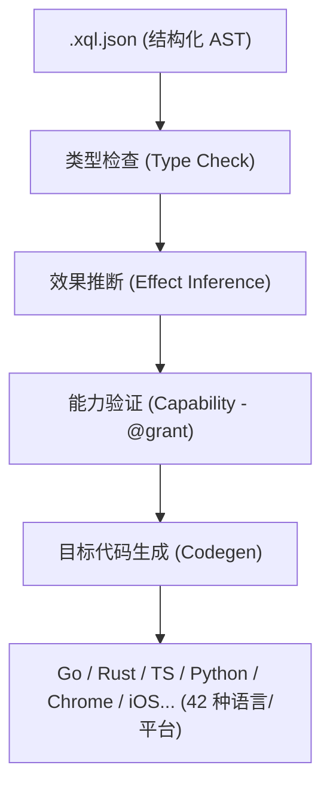

# Xiaoqinli (xql) 极简安全转译器 v3.2.0

[](https://goreportcard.com/report/github.com/Freecode100Year/xiaoqinli)
[](LICENSE)
[](go.mod)

---

## 📢 最新更新与 Bug 修复 (2026-07-01)

### 🆕 新增功能
- **Antigravity CLI 最高宪法 Docker 完全体升级**：全面升级并入了《Antigravity CLI 全栈前端与老旧项目逆向中间件最高宪法 (Docker 完全体)》（`AGY_RULES.md`）。在当前版本中，通过将本地 MCP 服务器以及同步审计环境打包进 Docker 容器沙箱，实现了物理级的宿主机权限防灾保护；同时支持将 10 秒影子暂存隔离写入容器内的 `tmpfs` 内存卷，实现物理硬盘零损耗和 I/O 硬件降噪。

---

## 📢 最新更新与 Bug 修复 (2026-06-30)

### 🆕 新增功能
- **Token 状态输出规范化**：在全局和项目规则中新增条款，要求每次任务完成、暂停或停止时，在回复的最后一句话显示当前 Token 消耗百分比及下一次 Token 重置的倒计时。
- **前端全栈准则防灾级更新**：在《Antigravity CLI 前端全栈项目语义蓝图与编程准则》中增补了“10秒本地影子闪存与突发灾难自愈”条款，确立了 10 秒周期静默暂存（`.xql/.shadow_stage/`）、网络异常指数退避续传、以及突发断电/强退后的开机影子重组与 AI 记忆对齐召回。
- **Chrome 网络诊断插件示例**：新增了 `examples/chrome_network.xql.json` 示例程序，利用 XQL 语言成功编译出一个 Chrome 扩展程序（Manifest V3，位于 `chrome-net-extension/` 目录下），实现了显示当前活动标签页的标题与 URL，物理联网类型与网络传输状态，并结合 Cloudflare DoH 异步解析 DNS（A记录）以测算真实延迟耗时。
- **前端全栈准则规范化**：增补了《Antigravity CLI 前端全栈项目语义蓝图与编程准则》，确立了 HTML/JS/CSS 在 YOLO 模式下的权限熔断、基于 Tree-sitter 的骨架提取压缩规范、前端双层审计静态拦截红线（内联样式与 ESLint 检验）、UI 状态锁定，以及 3-track 时空同步回撤机制。
- **行为准则规范化**：引入《Antigravity CLI 专属项目语义蓝图与编程准则》与《Antigravity CLI 多语言语义解耦与 Tree-sitter 宪法》作为项目最高的行为规范（在 `.agents/AGENTS.md` 中定义）。
- **自述文件文档重构**：将自述文件 (`README.md`) 全面改写为中文，精炼了架构和极简原则描述，并新增了编译期转译与静态分析的流水线（Mermaid 可视化关系图）。

### 🐛 修复问题
- **版本号不一致问题**：修正了 `README.md` 与主入口源码 `main.go` 中的 `Version` 常量（`3.2.0`）版本号不一致的问题。
- **Windows PowerShell 兼容问题**：修复了在 Windows 环境下使用 `&&` 符号连接命令导致的脚本报错问题，改用分步执行以增强跨平台兼容性。

---

**面向 AI Agent 的 AST-First 安全转译器。**  
输入一份结构化的 JSON AST，直接输出 42 个目标平台的原生惯用代码 —— 单一 Go 二进制文件，零第三方依赖，零运行时。



AI Agent 可以直接生成结构化的 `.xql.json` —— 物理上天然避免了语法错误和歧义解析。编译器在编译期对类型、副作用和能力（Capability）进行静态安全验证，验证通过后直接输出目标语言的高质量源码。

---

## 🎯 为什么选择 Xiaoqinli？

1. **AI Agent 原生设计**：AI 模型更擅长生成结构化的 JSON AST，而不是编写容易产生语法、括号和缩进错误的文本文档。
2. **单一可信源 (Single Source of Truth)**：一次编写 `.xql.json` 逻辑，即可直接编译部署到 42 个不同的目标平台 —— 从 Go 微服务、Chrome 插件、iOS 快捷指令到 MQL5 交易脚本。
3. **编译期静态安全保证**：类型检查、副作用推断和能力安全机制（`@grant` 验证）均在编译期完成，不带任何运行期不确定性。
4. **内置 MCP 支持**：原生作为 MCP (Model Context Protocol) 服务运行，无缝接入 Claude Code, Cursor 及任何兼容 MCP 的编辑器。

---

## ⚖️ 设计宪法：三要求优先于一切

在 v2.0 架构中，功能丰富度永远让位于以下三条原则（**做减法不做加法**）：
* **极简 (Minimal)**：单语言（Go）、单二进制、最少工具链、零第三方依赖。
* **安全 (Secure)**：所有静态分析与检查在编译期熔断，产出物完全确定，无任何运行期网络/LLM依赖。
* **高性能 (Fast)**：转译器无运行时开销，编译与转换均为毫秒级响应。

### v1.4 → v2.0 减法清单
为了追求极致的设计宪法，v2.0 删减了以下非核心模块：
* **移除 TypeScript 编译器核心**：消除了双语言栈，完全采用 Go 重写以降低维护成本。
* **移除 Aether VM + 字节码**：删除虚拟机运行层，AST 检查后直接生成目标代码。
* **移除自愈引擎 (Healer)**：运行期改代码是不确定且不可控的，不符合确定性原则。
* **移除运行期认知原语 (`predict/embed`)**：规避运行期的网络调用、LLM 调用与 Token 消耗。

---

## 🚀 快速开始

### 1. 编译安装
```bash
go build -o xql .
```

### 2. 命令行使用
```bash
# 验证 AST 合法性（不输出代码）
./xql validate --file examples/hello.xql.json

# 编译为指定语言/目标
./xql compile --file examples/hello.xql.json --target go
./xql compile --file examples/hello.xql.json --target rust   --out main.rs
./xql compile --file examples/hello.xql.json --target py     --out main.py
./xql compile --file examples/hello.xql.json --target chrome --out my-ext/

# 列出所有支持的目标平台
./xql targets
```

---

## 🌐 支持的目标平台 (共 42 种)

| 家族分类 | 目标语言/平台标识符 |
|--------|---------|
| **系统级语言** | `go` `rust` `c` `cpp` `zig` `d` `v` `nim` `vala` |
| **JVM/CLR 家族** | `java` `kotlin` `scala` `csharp` `dart` `groovy` |
| **脚本/解释型** | `py` `ts` `ruby` `lua` `php` `perl` `julia` `crystal` `awk` |
| **函数式语言** | `haskell` `ocaml` `fsharp` `elixir` `clojure` |
| **Shell 脚本** | `bash` `bat` `powershell` `tcl` |
| **领域/历史遗留** | `ada` `fortran` `pascal` `objc` `mql4` `mql5` |
| **专属平台** | `shortcut` (苹果 iOS 快捷指令) `chrome` (Chrome 浏览器插件) |

---

## 📐 双视图设计 (Dual-View Design)

* **AST 为唯一输入**：转译器仅接受 `.xql.json`（AST）文件作为有效输入。
* **人类可读视图**：`.xql` 纯文本文件仅作为单向渲染的**只读视图**，编译器中不包含 `.xql` 到 AST 的逆向解析器。这保证了核心转译器的极简性，并彻底杜绝了文本文档解析错误。

---

## 🛠️ 静态分析流水线

所有验证机制都在代码生成之前执行。只要有任意一项检查未通过，编译立刻熔断，不生成任何目标代码。

```
  JSON解析  →  类型检查  →  效果推断  →  能力安全验证  →  代码生成
 (XQL_E1xx)   (XQL_E2xx)    (XQL_E2xx)     (XQL_E3xx)       (XQL_E4xx)
```

1. **类型检查 (Type Check)**：验证变量、函数签名、返回值、操作符兼容性、数组及结构体字段类型等。
2. **效果推断 (Effect Inference)**：自动推断并传播副作用（`network`/`filesystem`/`state`）。若纯函数声明为 `@effects(["pure"])` 但被检测到副作用，则编译失败。
3. **能力安全验证 (Capability Check)**：基于 `@grant` 机制。被调用函数所需的能力集必须是调用函数声明能力的**子集**（能力继承），防止越权调用。

---

## 🔗 三通道接入

Xiaoqinli 提供了三种灵活的交互方式：

### 1. MCP (Model Context Protocol) 服务
原生支持 stdio 和 streamable HTTP 接入，非常适合集成到 Claude Code、Cursor 等 AI 开发工具中：
```bash
./xql stdio                      # 标准输入输出模式（本地集成推荐）
./xql http :8080                 # 远程流式 HTTP 模式
./xql http :8080 --mode rest     # 远程 REST API 模式
```

在 `~/.mcp.json` 中配置：
```json
{
  "mcpServers": {
    "xiaoqinli": {
      "command": "/path/to/xql",
      "args": ["stdio"]
    }
  }
}
```

### 2. REST API 接入
面向 Aider、独立脚本或任意标准 HTTP 客户端，通过轻量级 HTTP API 发送编译/验证请求。

### 3. Skills 技能分发
所有 AI 技能包使用 `go:embed` 嵌入二进制中，通过 MCP 的 `prompts/*` 和 REST 的 `/skills/*` 提供全自动化的 Agent 技能分发。

---

## 🐳 Docker 容器化与沙箱安全隔离 (Docker Sandbox & MCP)

为了走向工程化落地、解决多语言环境依赖，并保障在全自动驾驶（YOLO 模式）下的主机系统安全，`xiaoqinli` 提供了完全容器化的运行与审计环境。

### 核心优势 ✨

*   **彻底解决 Tree-sitter 环境地基污染**：Tree-sitter 在解析多语言源码骨架时，需要在不同平台上编译对应的 Parser 二进制库（如 `.so`, `.dll`, `.wasm`）。Docker 镜像中预装了完整的 C++ 编译环境、各类语言的编译依赖以及 Linter（ESLint, Stylelint, Ruff 等），实现开箱即用的多语言逆向解析与静态审计。
*   **YOLO 模式的绝对安全防火墙**：在开启 `--dangerously-skip-permissions` YOLO 全自动驾驶模式时，将本地 MCP 服务器完全隔离在 Docker 容器内部。容器仅通过数据卷（Volume）映射当前开发的项目目录，物理拦截任何由于 AI 幻觉引发的穿透宿主机、改动全局系统文件的高危破坏性行为。
*   **10 秒内存影子闪存（tmpfs 硬件降噪）**：在容器内，高频的 10 秒无感暂存（`.xql/.shadow_stage/`）直接挂载至内存文件系统（`tmpfs`）运行。完全避免了在宿主机物理固态硬盘上频繁读写产生的磁盘碎片和 I/O 资源占用，实现零延迟、零硬盘损耗。

### 快速部署 🚀

在项目根目录下通过 Compose 一键拉取并运行容器化本地 MCP 服务器与同步审计环境：

```bash
docker compose up -d
```

---

## 📂 项目结构

```
xiaoqinli/
  main.go                    # 命令行入口及版本管理 (v3.2.0)
  ast/
    nodes.go                 # 24 种 AST 节点定义及 JSON 解析器
    hash.go                  # 节点内容寻址哈希 (CAS)
  check/
    types.go                 # 类型检查器与效果推断系统
    capability.go            # 基于 @grant 的安全能力验证器
    check.go                 # 静态检查统筹器
  codegen/
    golang.go   rust.go      # 42 种语言和平台的后端代码生成器
    typescript.go python.go  
    util.go                  # 统一生成调度与共享工具
    codegen_test.go          # 跨后端单元测试
    roundtrip_test.go        # 编译及运行回环测试
  server/
    mcp.go                   # MCP 协议服务端 (支持 stdio 与 HTTP SSE)
    rest.go                  # 经典 REST API 服务端
    skills.go                # Skills 技能分发路由器
  vfs/
    workspace.go             # 基于会话的虚拟内存文件系统
  skills/                    # 内置技能文档 (通过 go:embed 打入二进制)
    xiaoqinli-usage-guide.md
    xiaoqinli-error-handbook.md
```

---

## 🧪 测试命令

```bash
go test ./...                    # 运行所有后端及逻辑测试
go test -v ./...                 # 详细模式运行测试
```

## 📄 开源协议

本项目采用 [MIT](LICENSE) 开源协议。
